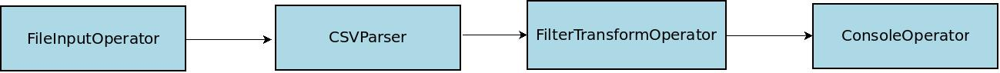

Before we delve into examples of using calcite with Apex ,we will go through required configuration for calcite.

You can go over details mentioned at tutorial about [schema discovery in Apache Calcite](https://calcite.apache.org/docs/tutorial.html#schema-discovery) 

## SQL Application with Model file as input:

## **Summary**:

This is going to be a demo app for showing how we can use SQL to extract information from one type of source such as input file / directory from  HDFS and save results to another output source. For this application output will be console.

    <configuration>

      <property>

        <name>modelFile</name>

        <value>src/main/resources/model/model_file_csv.json</value>

      </property>

      <property>

        <name>sql</name>

        <value>SELECT STREAM ROWTIME, PRODUCT FROM ORDERS</value>

      </property>

    </configuration>

**Configuration file for an application**

Configuration provided above will provide location of configuration file as "modelFile" and sql to be run as property “sql”. Path provided as property value for property “modelFile” is local path to developers environment . 

    {

      "version": "1.0",

      "defaultSchema": "APEX",

      "schemas": [{

        "name": "APEX",

        "tables": [

          {

            "name": "ORDERS",

            "type": "custom",

            "factory": "org.apache.apex.malhar.sql.schema.ApexSQLTableFactory",

            "stream": {

            "stream": true

            },

            "operand": {

              "endpoint": "file",

              "messageFormat": "csv",

              "endpointOperands": {

                "directory": "/user/hadoop/inputs/input.csv"

              },

              "messageFormatOperands": {

                "schema": "{\"separator\":\",\",\"quoteChar\":\"\\\"\",\"fields\":[{\"name\":\"RowTime\",\"type\":\"Date\",\"constraints\":{\"format\":\"dd/MM/yyyy hh:mm:ss\"}},{\"name\":\"id\",\"type\":\"Integer\"},{\"name\":\"Product\",\"type\":\"String\"},{\"name\":\"units\",\"type\":\"Integer\"}]}"

              }

            }

          }

        ]

      }

**model_file_csv.json**

This example will read from input data from location in HDFS mentioned as "directory" in model_file_csv.json. It can be either directory / file . To change input directory you need to relaunch an application by modifying model_file_csv.json. Schema format is provided as input through property “schema” and schema name is mentioned as property “name”.

    @Override

    public void populateDAG(DAG dag, Configuration conf)

    {

     String modelFile = conf.get("modelFile");

     String model;

     try {

       model = FileUtils.readFileToString(new File(modelFile));

     } catch (IOException e) {

       throw new RuntimeException(e);

     }

     SQLExecEnvironment.getEnvironment()

         .withModel(model)

         .executeSQL(dag, conf.get("sql"));

    }

In above code snipped we pass model file configuration to SQLExecEnvironment and dag and sql to be executed as input. 

**Physical Dag View of Application.**

## SQL Application with API:

In previous example we used model file to configure SQLExecution environment . But in this example we will configure environment by configuring input table explicitly through code.

    <configuration>

     <!-- Input Definition -->

     <property>

       <name>csvSchemaInName</name>

       <value>ORDERS</value>

     </property>

     <property>

       <name>csvSchemaIn</name>

       <value>{"separator":",","quoteChar":"\"","fields":[{"name":"RowTime","type":"Date","constraints":{"format":"dd/MM/yyyy hh:mm:ss Z"}},{"name":"id","type":"Integer"},{"name":"Product","type":"String"},{"name":"units","type":"Integer"}]}</value>

     </property>

     <property>

       <name>sourceFile</name>

       <value>/user/hadoop/inputs/input.csv</value>

     </property>

     <!-- Execution SQL -->

     <property>

       <name>sql</name>

       <value>SELECT STREAM ROWTIME, PRODUCT FROM ORDERS</value>

     </property>

    </configuration>

**Configuration file for an application**

 In above configuration file we have explicitly declared properties like csvSchemaInName, csvSchemaIn,sourceFile (input file from HDFS) and sql to be executed .

     @Override

     public void populateDAG(DAG dag, Configuration conf)

     {

       // Source definition

       String schemaInName = conf.get("csvSchemaInName");

       String schemaIn = conf.get("csvSchemaIn");

       String sourceFile = conf.get("sourceFile");

       SQLExecEnvironment.getEnvironment()

           .registerTable(schemaInName, new FileEndpoint(sourceFile, new CSVMessageFormat(schemaIn)))

           .executeSQL(dag, conf.get("sql"));

     }

** Physical Dag View of Application **

## PureSQLStyleApplication with Custom Function:

With Apache Calcite Integration, you can also use SQL queries across different data sources and provide custom functions as per your business logic. This example will use kafka as input source while HDFS file as output destination.

    <configuration>

     <!-- Input Definition -->

    <property>

       <name>schemaInName</name>

       <value>ORDERS</value>

    </property>

    <property>

       <name>schemaInDef</name>

       <value>{"separator":",","quoteChar":"\"","fields":[{"name":"RowTime","type":"Date","constraints":{"format":"dd/MM/yyyy hh:mm:ss Z"}},{"name":"id","type":"Integer"},{"name":"Product","type":"String"},{"name":"units","type":"Integer"}]}</value>

    </property>

    <property>

       <name>broker</name>

       <value>localhost:9090</value>

    </property>

    <property>

       <name>topic</name>

       <value>inputTopic</value>

    </property>

     <!-- Output Definition -->

    <property>

       <name>schemaOutName</name>

       <value>SALES</value>
    </property>

    <property>

       <name>schemaOutDef</name>

       <value>{"separator":",","quoteChar":"\"","fields":[{"name":"RowTime1","type":"Date","constraints":{"format":"dd/MM/yyyy hh:mm:ss Z"}},{"name":"RowTime2","type":"Date","constraints":{"format":"dd/MM/yyyy hh:mm:ss Z"}},{"name":"Product","type":"String"}]}</value>

    </property>

    <property>

       <name>outputFolder</name>

       <value>/tmp/output</value>

    </property>

    <property>

       <name>destFileName</name>

       <value>out.file</value>

    </property>

     <!-- Execution SQL -->

    <property>

       <name>sql</name>

       <value>INSERT INTO SALES SELECT STREAM ROWTIME, FLOOR(ROWTIME TO DAY), APEXCONCAT('OILPAINT', SUBSTRING(PRODUCT, 6, 7)) FROM ORDERS WHERE ID > 3 AND PRODUCT LIKE 'paint%'</value>

    </property>

    </configuration>

**Configuration file for an Application**

    public void populateDAG(DAG dag, Configuration conf)

    {

     // Source definition

     String schemaInName = conf.get("schemaInName");

     String schemaInDef = conf.get("schemaInDef");

     String broker = conf.get("broker");

     String sourceTopic = conf.get("topic");

     // Destination definition

     String schemaOutName = conf.get("schemaOutName");

     String schemaOutDef = conf.get("schemaOutDef");

     String outputFolder = conf.get("outputFolder");

     String outFilename = conf.get("destFileName");

     // SQL statement

     String sql = conf.get("sql");

     SQLExecEnvironment.getEnvironment()

         .registerTable(schemaInName, new KafkaEndpoint(broker, sourceTopic,

             new CSVMessageFormat(schemaInDef)))

         .registerTable(schemaOutName, new FileEndpoint(outputFolder, outFilename,

             new CSVMessageFormat(schemaOutDef)))

         .registerFunction("APEXCONCAT", this.getClass(), "apex_concat_str")

         .executeSQL(dag, sql);

    }

We can define custom function which can be used as part of SQL provided through configuration.

    env.registerFunction("APEXCONCAT", this.getClass(), "apex_concat_str");

Used function ‘apex_concat_str" should be implemented as per its usage:

    public static String apex_concat_str(String s1, String s2)

    {

     return s1 + s2;

    }

Custom function is used in SQL as follows in properties file where as other functions such as FLOOR, SUBSTRING are provided by Apache Calcite .

    INSERT INTO SALES SELECT STREAM ROWTIME, FLOOR(ROWTIME TO DAY), APEXCONCAT('OILPAINT', SUBSTRING(PRODUCT, 6, 7)) FROM ORDERS WHERE ID > 3 AND PRODUCT LIKE 'paint%'

**Physical Dag View of Fusion Style Application.**

## FustionStyleSQLApplication with Custom Function

As described in PureSQLStyleApplication we can use different datasources as source and sink while developing Apex Applications with Calcite.This example will describe how we can develop an application in which we can process any datastream to be input for SQL query parsed using Calcite integration. 

In this example we will use stream of data from topic as input source for SQL query and write to HDFS file after processing.

    <configuration>

     <!-- Kafka Operator Properties -->

     <property>

       <name>dt.operator.KafkaInput.prop.topics</name>

       <value>dataTopic</value>

     </property>

     <property>

       <name>dt.operator.KafkaInput.prop.clusters</name>

       <value>localhost:9092</value>  <!-- broker (NOT zookeeper) address -->

     </property>

     <!-- CSV Parser Properties -->

     <property>

       <name>dt.operator.CSVParser.prop.schema</name>

       <value>{"separator":",","quoteChar":"\"","fields":[{"name":"RowTime","type":"Date","constraints":{"format":"dd/MM/yyyy hh:mm:ss Z"}},{"name":"id","type":"Integer"},{"name":"Product","type":"String"},{"name":"units","type":"Integer"}]}</value>

     </property>

     <!-- SQL Properties -->

     <property>

       <name>sqlSchemaInputName</name>

       <value>FROMCSV</value>

     </property>

     <property>

       <name>sqlSchemaOutputName</name>

       <value>TOFILE</value>

     </property>

     <property>

       <name>folderPath</name>

       <value>/tmp/output</value>

     </property>

     <property>

       <name>fileName</name>

       <value>output.txt</value>

     </property>

     <property>

       <name>sqlSchemaOutputDef</name>

       <value>{"separator":",","quoteChar":"\"","fields":[{"name":"RowTime1","type":"Date","constraints":{"format":"dd/MM/yyyy hh:mm:ss Z"}},{"name":"RowTime2","type":"Date","constraints":{"format":"dd/MM/yyyy hh:mm:ss Z"}},{"name":"Product","type":"String"}]}</value>

     </property>

     <property>

       <name>sql</name>

       <value>INSERT INTO TOFILE SELECT STREAM ROWTIME, FLOOR(ROWTIME TO DAY), APEXCONCAT('OILPAINT', SUBSTRING(PRODUCT, 6, 7)) FROM FROMCSV WHERE ID > 3 AND PRODUCT LIKE 'paint%'</value>

     </property>

    </configuration>

**Configuration file for an Application**

    // Define Kafka Input Operator for reading data from Kafka

    KafkaSinglePortInputOperator kafkaInput = dag.addOperator("KafkaInput", KafkaSinglePortInputOperator.class);

    kafkaInput.setInitialOffset("EARLIEST");

    // Add CSVParser

    CsvParser csvParser = dag.addOperator("CSVParser", CsvParser.class);

    dag.addStream("KafkaToCSV", kafkaInput.outputPort, csvParser.in);

Once we define dag with Kafka InputOperator and csv parser which can parse data from kafka topic, we can register csvParser operator and schema in a SchemaEndpoint to register a table with provided name.

    // Register CSV Parser output as input table for first SQL

    SQLExecEnvironment env = SQLExecEnvironment.getEnvironment();

    Map<String, Class> fieldMapping = ImmutableMap.<String, Class>of(

       "RowTime", Date.class,

       "id", Integer.class,

       "Product", String.class,

       "units", Integer.class);

    env.registerTable(conf.get("sqlSchemaInputName"), new StreamEndpoint(csvParser.out, fieldMapping));

We can define custom function which can be used as part of SQL provided through configuration.

    env.registerFunction("APEXCONCAT", this.getClass(), "apex_concat_str");

Used function ‘apex_concat_str" should be implmented as per its usage:

    public static String apex_concat_str(String s1, String s2)

    {

     return s1 + s2;

    }

Custom function is used in SQL as follows in properties file where as other functions such as FLOOR, SUBSTRING are provided by Apache Calcite .

    INSERT INTO TOFILE SELECT STREAM ROWTIME, FLOOR(ROWTIME TO DAY), APEXCONCAT('OILPAINT', SUBSTRING(PRODUCT, 6, 7)) FROM FROMCSV WHERE ID > 3 AND PRODUCT LIKE 'paint%'

Finally we can define output schema name and register it as table with an environment before running SQL query.

    // Register FileEndpoint as output table for second SQL.

    env.registerTable(conf.get("sqlSchemaOutputName"), new FileEndpoint(conf.get("folderPath"),

       conf.get("fileName"), new CSVMessageFormat(conf.get("sqlSchemaOutputDef"))));

    // Add second SQL to DAG

    env.executeSQL(dag, conf.get("sql"));

**Physical Dag View of Fusion Style Application.**

