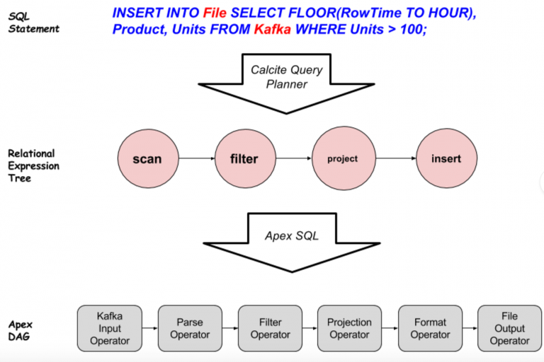

Apache Apex is a unified stream and batch processing engine that enables application developers to process data at very high throughput with low latency. Although the different types of data have different processing needs, SQL remains a popular and a generic way for processing data. To ensure that existing ETL developers and developers who are well versed with Database applications adopt stream processing application development with ease, integration of SQL with Apex was needed. Being a popular Apache project, Apache Calcite was chosen for this purpose and its integration with Apex is described below.

# Apex-Calcite Integration

Apache Calcite is a highly customizable engine for parsing and planning queries on relational data from various data sources; it provides storage independent optimization of queries and ways to integrate them into other frameworks which would like to take advantage and expose SQL capability to their users. For details, please read at [Apache Calcite Website](https://calcite.apache.org/). 

Particularly in SQL on Apex, Calcite processes a query and then creates relational algebra to create processing pipelines. These relational algebra processing pipelines are converted to a DAG with a set of operators to perform business logic on streaming data.



Above figure explains how SQL query gets converted to Apex DAG.

1. User specified query is processed by Calcite Query planner; this involves parsing and optimizing the query to generate Relation Expression Tree. 
3. This Relation Expression Tree is received by Apache Apex’s SQL module to finally convert to an Apex DAG having series of operators.

 One peculiarity of Calcite queries is that the data source and destination need not be RDBMS systems; in the above example, `File` refers to a file in the filesystem and `Kafka` to a Kafka message broker. Calcite allows Apex to register table sources and destinations as anything which can return a row type results. So a “scan” relational expression gets converted to “KafkaInputOperator + ParseOperator”, a result of which is series of POJOs reflecting a Row Type. Similarly, the “insert” Relational Expression translated to “FormatOperator + FileOutputOperator”.

For more details about the integration, click [here](https://github.com/apache/apex-malhar/tree/master/sql).
# SQL APIs for Apache Apex

Listed below are the Java APIs which can be used by SQL/Apex users to create a DAG in the implementation of the _populateDAG_ method of the `StreamingApplication` interface.

| API | Description |
|-----|:-----------:|
|**SQLExecEnvironment.getEnvironment()**| Creates a new SQL execution environment  |
|**SQLExecEnvironment.registerTable(tableName, endpointInstance)**| Registers a new abstract table with existing environment. _endpointInstance_ is an object of type [Endpoint](https://github.com/apache/apex-malhar/blob/master/sql/src/main/java/org/apache/apex/malhar/sql/table/Endpoint.java) which defines a table.  |
|**SQLExecEnvironment.registerFunction(sqlFunctionName, holderClass, staticFunctionName)**| Registers a new User Defined Scalar function |
|**SQLExecEnvironment.executeSQL(dag, sqlStatement)** | Creates a DAG for a particular SQL statement |

Usage of above APIs is described in detail in following sections.

## Example 1: Pure Style SQL Application

With Apache Calcite Integration, you can use SQL queries across different data sources and provide UDFs (User Defined Functions) as per your business logic. This example will use a Kafka topic as the source and a HDFS file as the destination.
Following application code will be used to explain APIs. Actual source code can be found [here](https://github.com/apache/apex-malhar/blob/master/demos/sql/src/main/java/org/apache/apex/malhar/sql/sample/PureStyleSQLApplication.java).
```java
  public class PureStyleSQLApplication implements StreamingApplication
  {
    @Override
    public void populateDAG(DAG dag, Configuration conf)
    {
       // Create new SQLExecEnvironment
       SQLExecEnvironment sqlEnv = SQLExecEnvironment.getEnvironment();
     
      // This is a string that defines a schema and is discussed in more detail in "Registering tables with SQLExecEnvironment" section 
      String inputSchemaString = "...";
      
      // similar to inputSchemaString, we also need to define outputSchemaString
      String outputSchemaString = "...";
      
       // Register KafkaEnpoint as "ORDERS" table with kafka topic and data format as CSV
       sqlEnv = sqlEnv.registerTable( 
                                    "ORDERS", 
                                    new KafkaEndpoint("localhost:9090", 
                                                      "inputTopic", 
                                                      new CSVMessageFormat(inputSchemaString))
                                  );
     
       // Register FileEndpoint as "SALES" table with file path and data format as CSV
       sqlEnv = sqlEnv.registerTable( 
                                    "SALES", 
                                    new FileEndpoint("/tmp/output", 
                                                     "out.file", 
                                                     new CSVMessageFormat(outputSchemaString))
                                  );
                                  
       // Register scalar SQL UDF 
       sqlEnv = sqlEnv.registerFunction("APEXCONCAT", PureStyleSQLApplication.class, "apex_concat_str");
     
       // Converting SQL statement to DAG 
       String sql = "INSERT INTO SALES 
                       SELECT STREAM ROWTIME, FLOOR(ROWTIME TO DAY), APEXCONCAT('OILPAINT', SUBSTRING(PRODUCT, 6, 7)) 
                       FROM ORDERS 
                       WHERE ID > 3 AND PRODUCT LIKE 'paint%'";
       sqlEnv.executeSQL(dag, sql);
    }// populateDAG finished
 
    public static String apex_concat_str(String s1, String s2)
    {
        return s1 + s2;
    } 
  }
```      
### Constructing SQLExecEnvironment
The class _**SQLExecEnvironment**_ provides a starting point and a simple way to define metadata needed for running a SQL statement; a new instance of this class is returned by the `getEnvironment` static method.  

```java
  // Creates SQLExecEnvironment instance by using static method getEnvironment
  SQLExecEnvironment sqlEnv = SQLExecEnvironment.getEnvironment();
```

### Registering tables with SQLExecEnvironment
Next, we need to register tables which can be used in a query. For this purpose, we can use _registerTable_ method from SQLExecEnvironment.
```java
  // Register KafkaEnpoint as "ORDERS" table with kafka topic and data format as CSV
  sqlEnv = sqlEnv.registerTable( 
                              "ORDERS", 
                              new KafkaEndpoint("localhost:9090", 
                                                "inputTopic", 
                                                new CSVMessageFormat(inputSchemaString))
                            );

  // Register FileEndpoint as "SALES" table with file path and data format as CSV
  sqlEnv = sqlEnv.registerTable( 
                              "SALES", 
                              new FileEndpoint("/tmp/output", 
                                               "out.file", 
                                               new CSVMessageFormat(inputSchemaString))
                            );
```

**_"registerTable"_** method takes the name of the table and an instance of endpoint as parameters. Endpoint signifies data storage mechanism and type of source/destination for the data. These endpoints require different types of configurations and possibly data formats. The data format is defined using an implementation of the `MessageFormat` interface; the `CSVMessageFormat` implementation can be configured with a schema string as follows:
```sql
{
  "separator": ",",
  "quoteChar": "\"",
  "fields": [
    {
      "name": "RowTime",
      "type": "Date",
      "constraints": {
        "format": "dd/MM/yyyy hh:mm:ss Z"
      }
    },
    {
      "name": "id",
      "type": "Integer"
    },
    {
      "name": "Product",
      "type": "String"
    },
    {
      "name": "units",
      "type": "Integer"
    }
  ]
}
```
The schema string is a JSON string defining a separator character, quote character for fields with String type and a list of fields where, for each field, its name, type and any additional constraints are specified.

Following data endpoints are supported: 

* **KafkaEnpoint**
: To define a Kafka Endpoint we need to specify the Kafka broker (as host:port), topic name and MessageFormat as seen in line 1 in the code above.
* **FileEndpoint**
: It needs to be configured with the filesystem path, file name and MessageFormat as in line 2 in the code above. 
* **StreamEndpoint** 
: This allows us to connect existing operator output or input ports to the SQL query as a data source or sink respectively. StreamEndpoint needs immediate downstream operator's input port or immediate upstream operator's output port and the field mapping for CSV data or POJO class. This will be explained in detail in next [example](#fusion-style-sql-application).


### Using User Defined Functions (UDF) in a SQL query

We can use our own scalar UDF, implemented in Java, in a SQL statement for data manipulation but first, we need to register the function with the execution environment by using the `registerFunction` method.

```java
  sqlEnv = sqlEnv.registerFunction("APEXCONCAT", PureStyleSQLApplication.class, "apex_concat_str");
```

In above code, **_registerFunction_** takes the UDF name to be used in SQL, JAVA class which implements the static method and name of that method as parameters. 
The static method `apex_concat_str` takes two String objects as input parameters from the SQL query.
```java    
  public static String apex_concat_str(String s1, String s2)
  {
    return s1 + s2;
  }
```

The scalar UDF "APEXCONCAT" that was registered above can be used in SQL as described below. FLOOR and SUBSTRING are standard SQL scalar functions supported by Apache Calcite.
```sql
INSERT INTO SALES 
       SELECT STREAM ROWTIME, FLOOR(ROWTIME TO DAY), APEXCONCAT('OILPAINT', SUBSTRING(PRODUCT, 6, 7)) 
       FROM ORDERS 
       WHERE ID > 3 AND PRODUCT LIKE 'paint%'
```
To read about all functions and operators supported by Apache Calcite, click [here](https://calcite.apache.org/docs/reference.html#operators-and-functions).

### Executing SQL Query 
Finally to execute the query we need to use **_executeSQL_** function with a DAG and SQL statement as parameters.

```java
  // Converting SQL statement to DAG 
  String sql = "INSERT INTO SALES 
                SELECT STREAM ROWTIME, FLOOR(ROWTIME TO DAY), APEXCONCAT('OILPAINT', SUBSTRING(PRODUCT, 6, 7)) 
                FROM ORDERS 
                WHERE ID > 3 AND PRODUCT LIKE 'paint%'";
  sqlEnv.executeSQL(dag, sql);
```
When executeSQL method is called, the query goes through various phases like conversion to relational algebra, optimization and planning in Calcite to generate Relation Expression Tree. 
The generated Relation Expression Tree is consumed by Apex SQL and converted to a DAG using operators available in Apache Malhar. In the above example, the ORDERS and SALES tables will be converted to the operators KafkaInputOperator and FileOutputFormatter respectively, paired with the CSVParser formatter in both cases.

A _WHERE_ clause is used in this query; it defines the desired filter for rows and is converted to a _FilterTransformOperator_ in the DAG. Similarly, the projection defining desired columns is converted into another instance of the _FilterTransformOperator_. The DAG created for this application will look like this:


<a name="fusion-style-sql-application"></a>
## Example 2: Fusion Style SQL Application 

As described in Pure Style SQL application, we can use different data sources as source and sink while developing Apex Applications with Calcite. This example will describe how we can develop Apex application with Apex stream as abstract table for SQL query. Actual source code can be found [here](https://github.com/apache/apex-malhar/blob/master/demos/sql/src/main/java/org/apache/apex/malhar/sql/sample/FusionStyleSQLApplication.java).


```java      
  // Define Kafka Input Operator for reading data from Kafka
  KafkaSinglePortInputOperator kafkaInput = dag.addOperator("KafkaInput", 
                                                           KafkaSinglePortInputOperator.class);

  kafkaInput.setInitialOffset("EARLIEST");

  // Add CSVParser
  CsvParser csvParser = dag.addOperator("CSVParser", CsvParser.class);
  dag.addStream("KafkaToCSV", kafkaInput.outputPort, csvParser.in);
```

Once we define DAG with KafkaInputOperator and CSVParser, it can parse data from Kafka topic. Upto this point, this is a regular Apex application without SQL. After this, we can register the output of CSVParser as a table using [StreamEndpoint](https://github.com/apache/apex-malhar/blob/master/sql/src/main/java/org/apache/apex/malhar/sql/table/StreamEndpoint.java) to run a SQL statement. This way we can develop applications in fusion style where the DAG is part SQL and part regular Apex DAG.

The following code will describe how we can define StreamEndpoint. 
 
```java  
  SQLExecEnvironment sqlEnv = sqlEnv.getEnvironment();
  Map<String, Class> fieldMapping = ImmutableMap.<String, Class>of("RowTime", Date.class,
                                                                 "id", Integer.class,
                                                                 "Product", String.class,
                                                                 "units", Integer.class);
  sqlEnv = sqlEnv.registerTable("FROMCSV", new StreamEndpoint(csvParser.out, fieldMapping));
```

To read existing data stream, we need to register it as a table with SQL execution environment with the name of the table and StreamEndpoint. StreamEndpoint can serve as input table or output table in SQL. For input table configuration we need to initialise StreamEndpoint with immediate upstream operator's output port and fieldMapping or POJO class for input tuple(as shown above). For output table configuration, we need to initialise StreamEndpoint with immediate downstream operator's input port and fieldMapping or POJO class for output tuple. Once we register StreamEndpoint as a table with a name in SQL Execution Environment, it can be used as a table in SQL statement similar to other endpoints.

When executeSQL method is called, the specified SQL is converted to DAG as described in the previous section. Both examples read CSV data from Kafka. But in the pure style SQL example the `KafkaInputOperator` and `CSVParser` in the DAG are created implicitly by the use of the KafkaEndpoint usage while in the fusion style example, they are explicitly defined as part of the DAG which is then extended with other operators as shown in the image below. 


For all Apex-Calcite integration examples, click [here](https://github.com/apache/apex-malhar/tree/master/demos/sql). 


# Ongoing efforts 

Apache Apex-Calcite integration provides support for basic queries and efforts are underway to extend support for aggregations, sorting and other features using Tumbling, Hopping and Session Windows.
Support for JSON, XML and JDBC endpoint are also planned. The goal of this integration is to make developing a streaming application using SQL easy so that SQL Developers don't have to write any java code at all.
