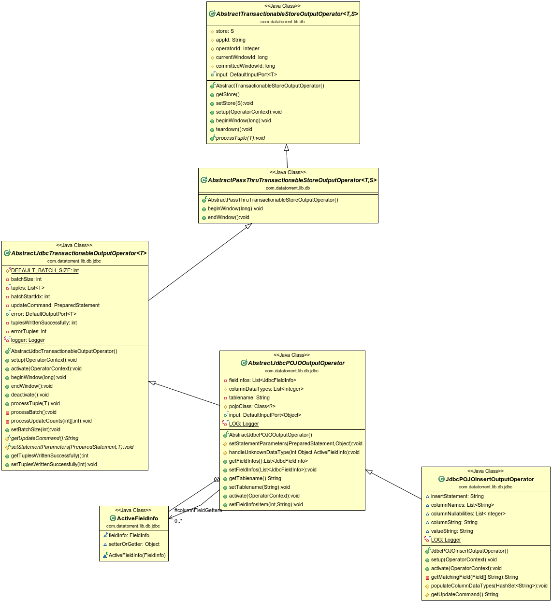

JDBC Transactional POJO Output Operator
==============

## Operator Objective
This operator receives an input stream of POJOs and inserts them as rows in a database table in a fault-tolerant way.

## Overview
The main features of this operator (`AbstractJdbcTransactionableOutputOperator`) are persisting data to the database table and fault tolerance. This operator creates a transaction at the start of each window, executes batches of SQL updates, and closes the transaction at the end of the window. Each tuple corresponds to an SQL update statement. The operator groups the updates in a batch and submits them with one call to the database. Batch processing improves performance considerably. The size of a batch is configured by `batchSize` property. The tuples in a window are stored in a check-pointed collection which is cleared in each `endWindow()` call. The operator writes a tuple exactly once in the database.

An (indirect) base class for this operator is `AbstractPassThruTransactionableStoreOutputOperator` which implements a pass-through output adapter for a transactional store; it guarantees exactly-once semantics. "Pass-through" means it does not wait for end window to write to the store. It will begin transaction at `beginWindow` and write to the store as the tuples come and commit the transaction at `endWindow`.

The overall heirarchy is described in the the following diagram:



`AbstractTransactionableStoreOutputOperator`: A skeleton implementation of an output operator that writes to a transactional store; the tuple type and store type are generic parameters. Defines an input port whose process method invokes the processTuple() abstract method. Exactly-once semantics are not guaranteed and must be provided by subclasses if needed.

`AbstractPassThruTransactionableStoreOutputOperator`: Simple extension of the above base class which adds exactly-once semantics by starting a transaction in `beginWindow()` and committing it in `endWindow()`.

`AbstractJdbcTransactionableOutputOperator`: (focus of this document) Adds support for JDBC by using an instance of JdbcTransactionalStore as the store. Also adds support for processing tuples in batches and provides an implementation of the `proessTuple()` abstract method mentioned above.

`AbstractJdbcPOJOOutputOperator`: Serves as base class for inserting rows in a table using a JDBC store.

**Note**: For enforcing exactly once semantics a table named `dt_meta` must exist in the database. The sample SQL to create the same is as follows
```
"CREATE TABLE IF NOT EXISTS dt_meta (dt_app_id VARCHAR(100) NOT NULL, dt_operator_id INT NOT NULL, dt_window BIGINT NOT NULL, UNIQUE(dt_app_id,dt_operator_id,dt_window))".
```
**Note**: Additionally this operator assumes that the underlying database/table in which records are to be added supports transactions. If the database/table does not support transactions then a tuple may be inserted in a table more than once in case of auto recovery from a failure (violation of exactly once semantics).

## Operator Information
1. Operator location: ***malhar-library***
2. Available since: ***0.9.4***
3. Java Packages:
    * Operator: ***[com.datatorrent.lib.db.jdbc.AbstractJdbcTransactionableOutputOperator](https://www.datatorrent.com/docs/apidocs/com/datatorrent/lib/db/jdbc/AbstractJdbcTransactionableOutputOperator.html)***

## How to Use?
 Concrete subclasses need to implement a couple of abstract methods (if not using AbstractJdbcPOJOOutputOperator): `setStatementParameters(PreparedStatement statement, T tuple)` to set the parameter of the insert/update statement (which is a PreparedStatement) with values from the tuple and `getUpdateCommand()` to return the SQL statement to update a tuple in the database.  Note that subclasses of AbstractJdbcPOJOOutputOperator need not define these methods since they are already defined in that class.

Several properties are available to configure the behavior of this operator and they are summarized in the table below.
### <a name="AbstractJdbcTransactionableOutputOperatorProps"></a>Properties of AbstractJdbcTransactionableOutputOperator
| **Property** | **Description** | **Type** | **Mandatory** | **Default Value** |
| -------- | ----------- | ---- | ------------------ | ------------- |
| *batchSize* | Maximum number of tuples to insert in a single call (see explanation above). | int | No | 1000 |

#### <a name="JdbcTransactionalStore"></a>Properties of JDBC Store
| **Property** | **Description** | **Type** | **Mandatory** | **Default Value** |
| -------- | ----------- | ---- | ------------------ | ------------- |
| *databaseDriver* |JDBC Driver class for connection to JDBC Store. This driver should be present in the class path | String | Yes | N/A |
| *databaseUrl* |["Database URL"](http://www.roseindia.net/tutorial/java/jdbc/databaseurl.html) of the form jdbc:subprotocol:subname | String | Yes | N/A |
| *userName* | Name of the user configured in the database | String | Yes | N/A |
| *password* | Password of the user configured in the database | String | Yes | N/A |

Those attributes can be set like this:

```xml
<property>
  <name>dt.operator.{OperatorName}.prop.batchSize</name>
  <value>500</value>
</property>

<property>
  <name>dt.operator.{OperatorName}.prop.store.databaseDriver</name>
  <value>com.mysql.jdbc.Driver</value>
</property>

<property>
  <name>dt.operator.{OperatorName}.prop.store.databaseUrl</name>
  <value>jdbc:mysql://localhost:3306/mydb</value>
</property>

<property>
  <name>dt.operator.{OperatorName}.prop.store.userName</name>
  <value>myuser</value>
</property>

<property>
  <name>dt.operator.{OperatorName}.prop.store.password</name>
  <value>mypassword</value>
</property>
```
### Abstract Methods
These methods are defined as abstract in AbstractJdbcTransactionableOutputOperator `void setStatementParameters(PreparedStatement statement, T tuple)`:Sets the parameter of the insert/update statement with values from the tuple.
`String getUpdateCommand()`:Gets the statement which insert/update the table in the database.


## AbstractJdbcPOJOOutputOperator
This is the abstract implementation extending the functionality of AbstractJdbcTransactionableOutputOperator that serves as base class for inserting rows in a table using a JDBC store. It has the definition for the abstract methods in AbstractJdbcTransactionableOutputOperator. It can be further extended to modify functionality or add new capabilities. This class has an input port to recieve the records in the form of tuples, so concrete subclasses won't need to provide the same, and processes/inserts each input tuple as a database table record. You need to set the input port attribute TUPLE_CLASS to define your [POJO](https://en.wikipedia.org/wiki/Plain_Old_Java_Object) class name to define Object type.

### <a name="AbstractJdbcPOJOOutputOperatorProps"></a>Properties of AbstractJdbcPOJOOutputOperator
Several properties are available to configure the behavior of this operator and they are summarized in the table below.

| **Property** | **Description** | **Type** | **Mandatory** | **Default Value** |
| -------- | ----------- | ---- | ------------------ | ------------- |
| *tablename* | Name of the table where data is to be inserted | String | Yes | N/A |
| *fieldInfos*| JdbcFieldInfo maps a store column to a POJO field name| List | Yes | N/A |

Those attributes can be set like this:

```xml
<property>
  <name>dt.operator.{OperatorName}.prop.tablename</name>
  <value>ResultTable</value>
</property>

<property>
  <name>dt.operator.{OperatorName}.fieldInfosItem[0]</name>
  <value>
  {
    "sqlType": 0,
    "columnName":"ID",
    "pojoFieldExpression": "id",
    "type":"INTEGER"
  }
  </value>
</property>

<property>
  <name>dt.operator.{OperatorName}.fieldInfosItem[1]</name>
  <value>
  {
    "sqlType": 4,
    "columnName":"NAME",
    "pojoFieldExpression": "name",
    "type":"STRING"
  }
  </value>
</property>
```


## Platform Attributes that influence operator behavior

| **Attribute** | **Description** | **Type** | **Mandatory** |
| -------- | ----------- | ---- | ------------------ |
| *TUPLE_CLASS* | TUPLE_CLASS attribute on input port which tells operator the class of POJO which is being received  | Class| Yes |

Those attributes can be set like this:

```xml
<property>
  <name>dt.operator.{OperatorName}.port.input.attr.TUPLE_CLASS</name>    
  <value>com.example.mydtapp.PojoEvent</value>
</property>
```

A concrete implementation is provided in Malhar as [JdbcPOJOInsertOutputOperator](https://github.com/apache/apex-malhar/blob/master/library/src/main/java/com/datatorrent/lib/db/jdbc/JdbcPOJOInsertOutputOperator.java).  The incoming tuples will be inserted in the table using PreparedStatement of the base class,  which is formed in `activate()` method of this operator.

## Features
The operator is **idempotent**, **fault-tolerant** and **statically partitionable**.

## Partitioning of JDBC Output Operator
#### Static Partitioning
Only static partitioning is supported for this operator.

Static partitioning can be achieved by specifying the partitioner and number of partitions in the populateDAG() method
```java
  JdbcPOJOInsertOutputOperator jdbcPOJOInsertOutputOperator = dag.addOperator("jdbcPOJOInsertOutputOperator", JdbcPOJOInsertOutputOperator.class);
  StatelessPartitioner<JdbcPOJOInsertOutputOperator> partitioner1 = new StatelessPartitioner<JdbcPOJOInsertOutputOperator>(2);
  dag.setAttribute(jdbcPOJOInsertOutputOperator, Context.OperatorContext.PARTITIONER, partitioner1);
```

Static partitioning can also be achieved by specifying the partitioner in properties file.
```xml
  <property>
    <name>dt.operator.{OperatorName}.attr.PARTITIONER</name>
    <value>com.datatorrent.common.partitioner.StatelessPartitioner:2</value>
  </property>
```

where {OperatorName} is the name of the JdbcPOJOInsertOutputOperator operator.
Above lines will partition JdbcPOJOInsertOutputOperator statically 2 times. Above value can be changed accordingly to change the number of static partitions.


#### Dynamic Partitioning
Not supported.

## Example
An example application using this operator can be found [here](https://github.com/DataTorrent/examples/tree/master/tutorials/fileToJdbc). This example shows how to read files from HDFS, parse into POJOs and then insert into a table in MySQL.
