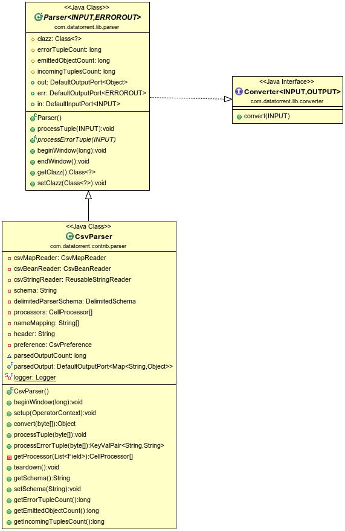

Csv Parser Operator
=============

## Operator Objective
This operator is designed to parse delimited records and construct a map or concrete java class also known as ["POJO"](https://en.wikipedia.org/wiki/Plain_Old_Java_Object) out of it. User need to provide the schema to describe the delimited data. Based on schema definition the operator will parse the incoming record to object map and POJO.  User can also provide constraints if any, in the schema. The supported constraints are listed in [constraints table](#constraints). The incoming record will be validated against those constraints. Valid records will be emitted as POJO / map while invalid ones are emitted on error port with error message.

**Note**: field names of POJO must match field names in schema and in the same order as it appears in the incoming data.

## Overview
The operator is **idempotent**, **fault-tolerant** and **partitionable**.

## Class Diagram


## Operator Information
1. Operator location:**_malhar-contrib_**
2. Available since:**_3.2.0_**
3. Operator state:**_Evolving_**
4. Java Package:[com.datatorrent.contrib.parser.CsvParser](https://github.com/apache/apex-malhar/blob/master/contrib/src/main/java/com/datatorrent/contrib/parser/CsvParser.java)


## <a name="props"></a>Properties of Csv Parser
User need to set the schema which describes delimited data as well as specifies constraints on values if any.
e.g.

```xml
{
  "separator":",",
  "quoteChar":"\"",
  "fields":[
    {
      "name":"adId",
      "type":"Integer",
      "constraints":{
         "required":"true"
      }
    },
    {
      "name":"adName",
      "type":"String",
      "constraints":{
         "required":"true",
         "pattern":"[a-z].*[a-z]$",
         "maxLength":"10"
      }
    },
    {
      "name":"bidPrice",
      "type":"Double",
      "constraints":{
         "required":"true",
         "minValue":"0.1",
         "maxValue":"3.2"
      }
    },
    {
      "name":"startDate",
      "type":"Date",
      "constraints":{
         "format":"yyyy-MM-dd HH:mm:ss"
      }
    }
  ]
}
```

| **Property** | **Description** | **Type** | **Mandatory** | **Default Value** |
| -------- | ----------- | ---- | ------------------ | ------------- |
| *schema* | [Schema](https://github.com/apache/apex-malhar/blob/master/contrib/src/main/java/com/datatorrent/contrib/parser/DelimitedSchema.java)  describing delimited data | String | YES | N/A |
 
## Platform Attributes that influences operator behavior

| **Attribute** | **Description** | **Type** | **Mandatory** |
| -------- | ----------- | ---- | ------------------ |
| *out.TUPLE_CLASS* | TUPLE_CLASS attribute on output port which tells operator the class of POJO which need to be emitted | Class| Yes |
 
## <a name="dataTypes"></a>Supported DataTypes in Schema
  * Integer
  * Long
  * Double
  * Character
  * String
  * Boolean
  * Date
  * Float

## <a name="constraints"></a>Schema Constraints 
|**DataType**| **Constraints** | **Description** |
| -------- | -------- | -------- |
| *All data Types* | required | If mentioned, indicates that the data type constraints that follow are required. It cannot be blank/null. It may or may not satisfy other constraints ( like equals/minVal/maxVal etc ) |
| *All data Types* | equals | If mentioned, indicates that the data string or value declared in the data type constraints must be an exact match with the specified value. `Note: This constraints is not applicable for data type boolean and date` |
| *String* | Length | The string must be of the length that is specified. |
| *String* | minLength | The string is at least the length specified as minLength value. |
| *String* | maxLength | The string can be at the most the length specified as maxLength value. |
| *String* | pattern | The string must match the specified regular expression. |
| *Long* | maxValue | The numeric can be at the most the value specified as maxValue. |
| *Long* | minValue | The numeric is at least the value specified as minValue. |
| *Double* | maxValue | The numeric can be at the most the value specified as maxValue. |
| *Double* | minValue | The numeric is at least the value specified as minValue. |
| *Float* | maxValue | The numeric can be at the most the value specified as maxValue. |
| *Float* | minValue | The numeric is at least the value specified as minValue. |
| *Integer* | maxValue | The numeric can be at the most the value specified as maxValue. |
| *Integer* | minValue | The numeric is at least the value specified as minValue. |
| *Date* | format | A simple date format as specified in the SimpleDateFormat class: http://docs.oracle.com/javase/8/docs/api/java/text/SimpleDateFormat.html?is-external=true |
| *Boolean* | trueValue | String for which boolean value is true. The default values are: true, 1, y, and t. `Note: If you specify trueValue, you must also specify falseValue.` |
| *Boolean* | falseValue | String for which boolean value is false. The default values are: false, 0, n, and f. `Note: If you specify falseValue, you must also specify trueValue.` |

 
## Ports

| **Port** | **Description** | **Type** | **Mandatory** |
| -------- | ----------- | ---- | ------------------ |
| *in* | Tuples that needs to be parsed are recieved on this port | byte[] | Yes |
| *out* | Valid Tuples that are emitted as pojo | Object (POJO) | No |
| *parsedOutput* | Valid Tuples that are emitted as map | Map | No |
| *err* | Invalid Tuples are emitted with error message | KeyValPair <String, String\> | No |

## Partitioning
CSV Parser is both statically and dynamically partitionable.
### Static Partitioning
This can be achieved in 2 ways as shown below.

Specifying the partitioner and number of partitions in the populateDAG() method

```java
    CsvParser csvParser = dag.addOperator("csvParser", CsvParser.class);
    StatelessPartitioner<CsvParser> partitioner1 = new StatelessPartitioner<CsvParser>(2);
    dag.setAttribute(csvParser, Context.OperatorContext.PARTITIONER, partitioner1);
```

Specifying the partitioner in properties file.
```xml
   <property>
     <name>dt.operator.{OperatorName}.attr.PARTITIONER</name>
     <value>com.datatorrent.common.partitioner.StatelessPartitioner:2</value>
   </property>
```

where {OperatorName} is the name of the CsvParser operator.
 Above lines will partition CsvParser statically 2 times. Above value can be changed accordingly to change the number of static partitions.


### Dynamic Paritioning

CsvParser can be dynamically partitioned using out-of-the-box partitioner:

#### Throughput based
Following code can be added to populateDAG method of application to dynamically partition CsvParser:
```java
CsvParser csvParser = dag.addOperator("csvParser", CsvParser.class);
StatelessThroughputBasedPartitioner<CsvParser> partitioner = new StatelessThroughputBasedPartitioner<>();
partitioner.setCooldownMillis(conf.getLong(COOL_DOWN_MILLIS, 10000));
partitioner.setMaximumEvents(conf.getLong(MAX_THROUGHPUT, 30000));
partitioner.setMinimumEvents(conf.getLong(MIN_THROUGHPUT, 10000));
dag.setAttribute(csvParser, OperatorContext.STATS_LISTENERS, Arrays.asList(new StatsListener[]{partitioner}));
dag.setAttribute(csvParser, OperatorContext.PARTITIONER, partitioner);
```

Above code will dynamically partition csvParser when the throughput changes.
If the overall throughput of csvParser goes beyond 30000 or less than 10000, the platform will repartition CsvParser
to balance throughput of a single partition to be between 10000 and 30000.
CooldownMillis of 10000 will be used as the threshold time for which the throughput change is observed.

## Example
Example for Csv Parser can be found at: [https://github.com/DataTorrent/examples/tree/master/tutorials/parser](https://github.com/DataTorrent/examples/tree/master/tutorials/parser)

