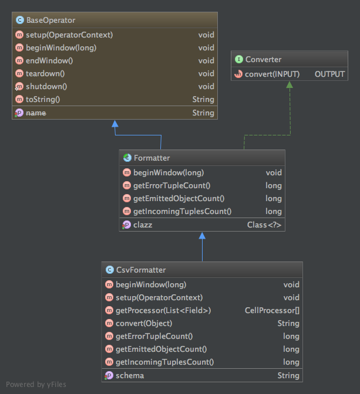

CsvFormatter Operator
=====================

CsvFormatter converts the incoming POJO to CSV(by default) or custom('|', ':' etc.) separated string. CsvFormatter Operator is fault-tolerant and scalable Malhar Operator.

### Why is it needed ?

This is a pluggable and scalable implementation of POJO to custom delimited string conversion. The json schema which is user defined is used to evaluate the object fields and append the fields to the string separated by the delimiter configured.  

### CsvFormatter

This is a schema enabled Formatter.



#### Properties
<table>
<col width="25%" />
<col width="75%" />
<tbody>
<tr class="odd">
<td align="left"><p>Parameter</p></td>
<td align="left"><p>Description</p></td>
</tr>
<tr class="even">
<td align="left"><p>schema</p></td>
<td align="left"><p>The schema string in Json format that represents the format of the output string. This is used to evaluate the fields in the POJO. </p></td>
</tr>
<tr class="odd">
<td align="left"><p>TUPLE_CLASS</p></td>
<td align="left"><p>The input POJO class to the CsvFormatter.</p></td>
</tr>
</tbody>
</table>


### Supported data types

The below are the supported data types by CsvFormatter operator.
```
    BOOLEAN, DOUBLE, INTEGER, FLOAT, LONG, SHORT, CHARACTER, STRING, DATE
```


#### Properties and Constraints supported by schema to evaluate pojo fields
<table>
<col width="25%" />
<col width="75%" />
<tbody>
<tr class="odd">
<td align="left"><p>Parameter</p></td>
<td align="left"><p>Description</p></td>
</tr>
<tr class="even">
<td align="left"><p>separator</p></td>
<td align="left"><p>JSON key string for delimiter between fields. Default value is comma (,)</p></td>
</tr>
<tr class="odd">
<td align="left"><p>quoteChar</p></td>
<td align="left"><p>JSON key string for quote char. Default value is quote (")</p></td>
</tr>
<tr class="even">
<td align="left"><p>lineDelimiter</p></td>
<td align="left"><p>JSON key string for line delimiter. Default value is new line character (\r\n) </p></td>
</tr>
</tr>
<tr class="odd">
<td align="left"><p>required</p></td>
<td align="left"><p>JSON key string for required(mandatory) constraint</p></td>
</tr>
<tr class="even">
<td align="left"><p>equals</p></td>
<td align="left"><p>JSON key string for equals constraint</p></td>
</tr>
<tr class="odd">
<td align="left"><p>length</p></td>
<td align="left"><p>JSON key string for length constraint</p></td>
</tr>
</tr>
<tr class="even">
<td align="left"><p>minLength</p></td>
<td align="left"><p>JSON key string for min length constraint</p></td>
</tr>
<tr class="odd">
<td align="left"><p>maxLength</p></td>
<td align="left"><p>JSON key string for max length constraint</p></td>
</tr>
<tr class="even">
<td align="left"><p>minValue</p></td>
<td align="left"><p>JSON key string for max value constraint</p></td>
</tr>
<tr class="odd">
<td align="left"><p>maxValue</p></td>
<td align="left"><p>JSON key string for max value constraint</p></td>
</tr>
<tr class="even">
<td align="left"><p>pattern</p></td>
<td align="left"><p>JSON key string for Regex pattern constraint</p></td>
</tr>
<tr class="odd">
<td align="left"><p>format</p></td>
<td align="left"><p>JSON key string for date format constraint</p></td>
</tr>
<tr class="even">
<td align="left"><p>loale</p></td>
<td align="left"><p>JSON key string for locale constraint</p></td>
</tr>
<tr class="odd">
<td align="left"><p>trueValue</p></td>
<td align="left"><p>JSON key string for true value constraint</p></td>
</tr>
<tr class="even">
<td align="left"><p>falseValue</p></td>
<td align="left"><p>JSON key string for false value constraint</p></td>
</tr>
</tbody>
</table>

### Example to configure CsvFormatter

Below is the code snippet to configure:

```java

    CsvFormatter formatter = dag.addOperator("formatter", CsvFormatter.class);
    //Loading Schema Json string from a config file - schema is of type String
    formatter.setSchema(SchemaUtils.jarResourceFileToString(filename));
    dag.setInputPortAttribute(formatter.in, PortContext.TUPLE_CLASS, PojoEvent.class);
    
```

Example Json String: 

```json
{
	"separator": "|",
	"quoteChar": "\"",
	"lineDelimiter": "\n",
	"fields": [
		{
			"name": "adId",
			"type": "Integer"

		},
		{
			"name": "campaignId",
			"type": "Integer",
			"constraints": {
				"equals": "98233"
			}
		},
		{
			"name": "campaignName",
			"type": "String",
			"constraints": {
				"required": "true",
				"pattern": "[a-z].*[a-z]$",
				"maxLength": "10"
			}
		},
		{
			"name": "campaignBudget",
			"type": "Double",
			"constraints": {
				"required": "true",
				"minValue": "0",
				"maxValue": "320000"
			}
		},
		{
			"name": "startDate",
			"type": "Date",
			"constraints": {
				"format": "yyyy-MM-dd"
			}
		},
		{
			"name": "endDate",
			"type": "Date",
			"constraints": {
				"format": "dd/MM/yyyy"
			}
		},
		{
			"name": "securityCode",
			"type": "Long",
			"constraints": {
				"minValue": "10",
				"maxValue": "30"
			}
		},
		{
			"name": "weatherTargeting",
			"type": "Boolean"

		},
		{
			"name": "optimized",
			"type": "Boolean",
			"constraints": {
				"trueValue": "OPTIMIZE",
				"falseValue": "NO_OPTIMIZE"
			}
		},
		{
			"name": "parentCampaign",
			"type": "String",
			"constraints": {
				"required": "true",
				"equals": "CAMP_AD"
			}
		},
		{
			"name": "weatherTargeted",
			"type": "Character",
			"constraints": {
				"required": "true",
				"equals": "Y"
			}
		}
	]
}

```
