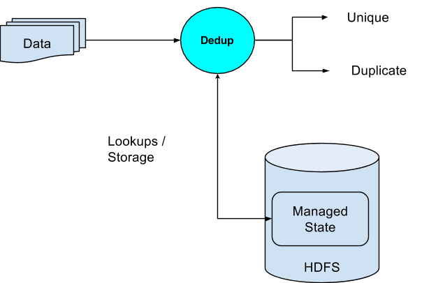
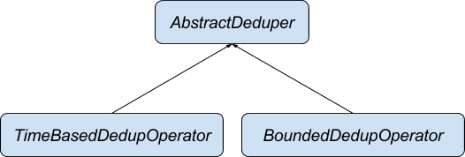
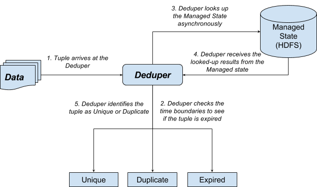
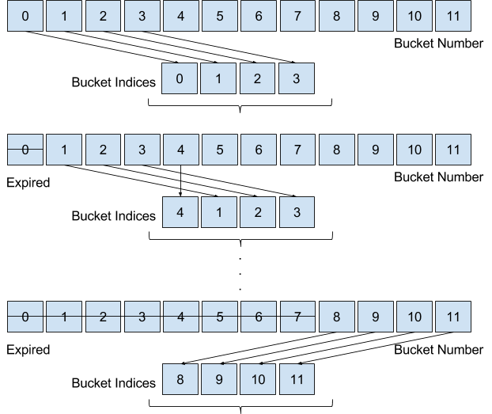

Deduper - Operator Documentation
=============

Introduction
=========================

About this document
--------------------------------

This document is intended as a guide for understanding and using
the Dedup operator.

Terminology
------------------------

We will refer to this operator as the Deduper or Dedup operator
interchangeably.

Overview
=====================

Dedup - “What” in a Nutshell
-----------------------------------------

Dedup is actually short for Deduplication. Duplicates are omnipresent and
can be found in almost any kind of data. Most of the times it is
essential to discard, or at the very least separate out the data into
unique and duplicate components. The entire purpose of this
operator is to de-duplicate data. In other words, when data passes
through this operator, it will be segregated into two different data
sets, one of which contains all unique tuples, and the other which are
occurring more than once in the original data set.


Dedup - “How” in a Nutshell
----------------------------------------

In order to quickly decide whether an incoming tuple is duplicate
or unique, it has to store each incoming tuple (or a signature, like key,
for example) to be used for comparison later. A plain in-memory storage
may work for small datasets, but will not scale for large ones. Deduper employs a large scale distributed persistent hashing mechanism (known as the Managed State) which allows
it to identify if a particular tuple is duplicate or unique. Managed state is a layer on HDFS which allows all the stored data to be persisted in a distributed fashion.
Each time it identifies a tuple as a unique tuple, it also
stores it into the Managed state for future
lookup.


-----------------------------------------------------------------------------------------------------------------------------------------------------------------------------------------------------------------------------------------------------------------------------

Following are the different components of the Deduper

1.  **Dedup Operator** - This is responsible for the overall
    functionality of the operator. This in turn makes use of other
    components to establish the end goal of deciding whether a tuple is
    a duplicate of some earlier tuple, or is a unique tuple.
2.  **Managed State** - Since, all of the data cannot be stored in
    memory, this component allows us to persist existing unique keys on
    HDFS in form of buckets. This is also responsible for fetching data as
    requested by the Deduper. Since, it communicates with the HDFS, data access is slow and so it allows for asynchronous (non-blocking) calls to fetch data. This ensures that the Deduper is not blocked and can continue to process other tuples. It also supports an in-memory cache where it stores the fetched data so that repeated access to the same data is faster. Periodically, based on configuration, this also
    discards data which is no longer needed.

This was a very basic introduction to the functioning of the
Deduper. Following sections will go into more detail on each of the
components.

Use cases - Basic Dedup
====================================

Dedup Key
----------------------

A dedup key is a set of one or more fields in the data tuple which
acts as the key for the tuples.
This is used by the deduper to compare tuples to arrive at the
conclusion on whether two tuples are duplicates.


Consider an example schema and two sample tuples

`{Name, Phone, Email, Date, State, Zip, Country}`


Tuple 1:
```
{
  Austin U. Saunders,
  +91-319-340-59385,
  ausaunders@semperegestasurna.com,
  2015-11-09 13:38:38,
  Texas,
  73301,
  United States
}
```


Tuple 2:
```
{
  Austin U. Saunders,
  +91-319-340-59385,
  austin@semperegestasurna.com,
  2015-11-09 13:39:38,
  Texas,
  73301,
  United States
}
```


Let us assume that the Dedup Key
is `{Name, Phone}`. In
this case, the two tuples are duplicates because the key fields are same
in both the tuples. However, if the Dedup Key is {Phone,Email},
the two are unique as the email values differ.


Use case Details
-----------------------------

Consider the case of de-duplicating a master data set
which is stored in a file. Further also consider the
following schema for tuples in the data set.

`{Name, Phone, Email, Date, City, Zip, Country}`

Also consider that we need to identify unique customers from the
master data set. So, ultimately the output needed for the use case is
two data sets - Unique Records and Duplicate Records.

As part of configuring the operator for this use case, we need to
set the following parameters:

-   ***keyExpression*** - This can be set as
    the primary key which can be used to uniquely identify a Customer.
    For example, we can set it to `Name,Email`


The above configuration is sufficient to address this use case.


Use case - Dedup with Expiry
=========================================

Motivation
-----------------------

The Basic Dedup use case is the most straightforward and is
usually applied when the amount of data to be processed is not huge.
However, if the incoming data is huge, or even never-ending, it is
usually not necessary to keep storing all the data. This is because in
most real world use cases, the duplicates occur only a short distance
apart. Hence, after a while, it is usually okay to forget part of
the history and consider only limited history for identifying
duplicates, in the interest of efficiency. In other words, we expire
(ignore) some tuples which are (or were supposed to be) delivered long
back. Doing so, reduces the load on the storage mechanism (managed state) which effectively deletes part of the history, thus making the whole process more
efficient. We call this use case, Dedup with expiry.

Expiry Key
-----------------------

The easiest way to understand this use case is to consider
time as the criterion for expiring
tuples. Time is a natural expiry
key and is in line with the concept of expiry. Formally, an expiry field
is a field in the input tuple which can be used to discard incoming
tuples as expired. This expiry key
usually works with another parameter called Expiry Period defined
next.

Expiry Period
--------------------------

The expiry period is the value supplied by the user to define the
extent of history which should be considered while expiring
tuples.

Use case Details
-----------------------------

Consider an incoming stream of system logs. The use case requires
us to identify duplicate log messages and pass on only the unique ones.
Another relaxation in the use case is that the log messages which are
older than a day, may not be considered and must be filtered out as
expired. The expiry must be measured with respect to the time stamp in
the logs. For example, if the timestamp in the incoming message is
`30-12-2014 00:00:00` and the
latest message that the system has encountered had the time stamp
`31-12-2014 00:00:00`, then the
incoming message must be considered as expired. However, if the incoming
message had any timestamp like `30-12-2014
00:11:00`, it must be accepted into the system and be checked for a possible duplicate.

The expiry facet in the use case above gives us an advantage in
that we do not have to compare the incoming record with all the data to check if it is a duplicate.
At the same time, all the
incoming data need not be stored; just a day worth of data is adequate to address the above use case.


Configuring the below parameters will solve the problem for this
use case:

-   ***keyExpression*** - This is the dedup key for the incoming tuples (similar to the Basic Dedup use case). This can be any key which can uniquely identify a record. For log messages this can be a serial number attached in the log.
-   ***timeExpression*** - This is the key which can help identify the expired records, as explained above. In this particular use case, it can be a timestamp field which indicates when the log message was generated.
-   ***expireBefore*** - This is the period of expiry as explained above. In our example use case this will be 24 hour, specified in seconds.


Configuration of the above parameters is sufficient to address this use
case.

Use cases - Summary
================================

1.  **Basic Dedup** - Deduplication of
    bounded datasets. Data is assumed to be bounded. This use case is
    not meant for never ending streams of data. For example:
    Deduplication of master data like customer records, product catalogs
    etc.
2.  **Time Based Dedup** - Deduplication of
    unlimited streams of data. This use case handles unbounded streams
    of data and can run forever. An expiry key and criterion is expected
    as part of the input which helps avoid storing all the unique data.
    This helps speed up performance. Any timestamp field in the incoming
    tuple can be used as a time based expiry key.
    -  *With respect to system time* - Time progresses with system time. Any expiry criteria are executed with the notion of system time. This is possible if the incoming tuple does not have a time field, or the user does not specify a `timeExpression`.
    -  *With respect to tuple time* - Time progresses based on the time in the incoming tuples. Expiry criteria are executed with the notion of time indicated by the incoming tuple. Specification of the time field (`timeExpression`) is mandatory for this scenario.

Technical Architecture
===================================
Class Structure
----------------------------



---------------

Architectural Details
----------------------------------



Concepts
---------------------

### Dedup Key - Specified by *keyExpression* parameter

A dedup key is a set of one or more fields in the data tuple which
acts as the key for the tuples.
This is used by the deduper to compare tuples to arrive at the
conclusion on whether two tuples are duplicates. If Dedup Key of two
tuples match, then they are duplicates, else they are unique.

### Expiry Key - Specified by *timeExpression* parameter

A tuple may or may not have an Expiry Key. Dedup operator cannot
keep storing all the data that is flowing into the operator. At some
point it becomes essential to discard some of the historical tuples in
interest of memory and efficiency.

At the same time, tuples are expected to arrive at the Dedup
operator within some time after they are generated. After this time, the
tuples may be considered as stale or obsolete.

In such cases, the Deduper considers these tuples as
expired and takes no action other than
separating out these tuples on a different port in order to be processed
by some other operator or stored offline for analysis.

In order to create a criterion for discarding such tuples, we
introduce an Expiry Key. Looking at the value of the Expiry Key in each
tuple, we can decide whether or not to discard this tuple as
expired.

The expiry key that we consider in Time Based Dedup is
time. This usually works with
another parameter called Expiry Period defined next.

### Expiry Period

The Expiry Period is the value supplied by the user which decides
when a particular tuple expires.

### Time Points

For every dataset that the deduper processes, a set of time points is maintained:

1.  *Latest Point* - This is the maximum
    time point observed in all the processed tuples.
2.  *Expiry Point* - This is given by:
    `Expiry Point = Latest Point - Expiry Period`

These points help the deduper to make decisions related to expiry
of a tuple.

### Example - Expiry

|Tuple Id|Expiry Key (Expiry Period = 10)|Latest Point|Expiry Point|Decision for Tuple|
|:------:|:-----------------------------:|:----------:|:----------:|:----------------:|
|1|10|10|1|Not Expired|
|2|20|20|11|Not Expired|
|3|25|25|16|Not Expired|
|4|40|40|31|Not Expired|
|5|21|40|31|Expired|
|6|35|40|31|Not Expired|
|7|45|45|36|Not Expired|
|8|57|57|48|Not Expired|


### Time Buckets (A component of Managed State)

One of the requirements of the Deduper is to store all the unique
tuples (actually, just the keys of tuples). Keeping an ever growing
cache in memory is not scalable. So what we need is a limited cache
backed by a persistent store. When data is requested to be fetched from managed
state, it is also cached in an in-memory cache. Buckets help
narrow down the search of duplicates for incoming tuples. A Bucket is an
abstraction for a collection of tuples all of which share a common hash
value based on some hash function or a range of time, for example: a
bucket of data for 5 contiguous minutes. A Bucket has a span property called Bucket Span.

### Bucket Span

Bucket span is simply the range of the domain
that is covered by the Bucket. This span is specified in
the domain of the Expiry key. If the Expiry
Key is time,  then the Bucket span
will be specified in seconds. It is
only defined in case tuples have an Expiry Key.

### Number of Buckets

The number of buckets can be given by - `Num Buckets = Expiry
Period / Bucket Span`

This is because at any point of time, we need only store Expiry
Period worth of data.

### Example - Buckets



Assumptions
------------------------

### Assumption 1 <a name="Assumption1"></a>

This assumption is only applicable in case of Dedup with
Expiry.

For any two tuples, t1 and t2 having dedup keys d1 and d2, and
expiry keys e1 and e2, respectively, the following holds:

```
If d1 = d2,
  then e1 = e2
```
In other words, there may never
be two tuples t1 and t2 such that:
```
Tuple 1: d1, e1
Tuple 2: d2, e2
d1 = d2 and e1 != e2
```
In other words, any two tuples with the same dedup key are assumed to have the
same expiry key as well.
This assumption was made with respect to certain use cases. These
use cases follow this assumption in that the records which are
duplicates are exactly identical. An example use case is when log
messages are replayed erroneously, and we want to identify the duplicate
log messages. In such cases, we need not worry about two different log
messages having the same identifier but different timestamps. Since its
a replay of the same data, the duplicate records are assumed to be
exactly identical.

In case the duplicate tuple has a different value for expiry key, the behavior of
the deduper can be non-deterministic.

Flow of a Tuple through Dedup Operator
---------------------------------------------------

Tuples flow through the Dedup operator one by one. Deduper may process a tuple immediately, or store it in some data
structure for later processing.

When a tuple always arrives at the input
port of the Dedup operator, it does
the following tasks.

#### Check if tuple is Expired

This is only done in case of Dedup with expiry. The
following condition is used to check if the tuple is expired.

```
if ( Latest Point - Expiry Key < Expiry Point )
  then Expired
```
If the tuple is expired, then send it to the expired port.

#### Check if tuple is a Duplicate or Unique

Once a tuple passes the check of expiry, we proceed to check if
the tuple is a duplicate of some earlier tuple. Note that
if the tuple in question is not expired, the duplicate will also not
have expired due to the assumption listed [here](#Assumption1).
The Deduper queries the Managed state to fetch the value for the tuple key.
This request is processed by the Managed state in a separate asynchronous thread.
Once this request is submitted, the Deduper moves on to process other
tuples. Additionally the Deduper also inserts the tuple being processed
into a waiting events queue for later processing.

#### Process pending tuples
Once the Deduper has looked at the all the tuples in the current window,
it starts to process the tuples in the waiting queue to finalize the decision
(unique or duplicate) for these tuples.
Once the request to Managed state is completed for a tuple and the value is
fetched from persistent storage, the Deduper can decide if the tuple in
question is a duplicate or a unique.
Depending on whether there is enough time left in the current window,
it can do one of the following:

- Process only the tuples for which the managed state has completed processing.
The tuples which are still being processed by managed state are skipped only to come back to them when it can no longer postpone it. This is typically done when the operator
has idle time as there are no tuples on the input ports and the current window
has still not ended.
- Block on them to complete their processing. This will happen when the current
window has no time left, and the decision cannot be postponed. Note: An operator can end its window, only when all the tuples have been completely processed.  


Ports, Attributes and Properties
==========================================================

Ports
------------------

The deduper has a single input port and multiple output
ports.


-   ***input*** - This is the input port through
    which the tuples arrive at the Deduper.
-   ***unique*** - This is the output port on
    which unique tuples are sent out by the Deduper.
-   ***duplicate*** - This is the output port on
    which duplicate tuples are sent out by the Deduper.
-   ***expired*** - This is the output port on
    which expired tuples are sent out by the Deduper.

The user can choose which output ports to connect the down stream operators.
All the output ports are optional and can be used as required by the use case.

Attributes
-----------------------

-   ***Input port Attribute - input.TUPLE\_CLASS*** - Class or the fully
qualified class name.
    -   Mandatory attribute
    -   Tells the operator about the type of the incoming
    tuple.


Properties
-----------------------

-   ***keyExpression*** - String
    -   Mandatory parameter.
    -   The java expression to extract the key fields in the incoming tuple (POJO)


-   ***timeExpression*** - String - (Time Based Deduper only)
    -   The java expression to extract the time field in the incoming tuple (POJO).


-   ***expireBefore*** - Long (Seconds) - (Time Based Deduper only)
    -   This is the total time period during which a tuple stays in the system and blocks any other tuple with the same key.


-   ***bucketSpan*** - Long (Seconds) - (Time Based Deduper only)
    -   Mandatory parameter
    -   This is the unit which describes how large a bucket can be. Typically this should be defined depending on the use case. For example, if we have expireBefore set to 1 hour, then typically we would be clubbing data in the order of minutes, so a `bucketSpan` of a few minutes would make sense. Note that in this case, the entire data worth the `bucketSpan` will expire as a whole. Setting it to 1 minute would make the number of time buckets in the system to be 1 hour / 1 minute = 60 buckets.  Similarly setting bucketSpan to 5 minutes would make number of buckets to be 12.
    - Note that having too many or too few buckets could have a performance impact. If unsure, set the bucketSpan to the square root of `expireBefore`. This way the number of buckets and bucket span are balanced.


-   ***referenceInstant*** -  Long (Seconds) - (Time Based Deduper only)
    -   The reference point from which to start the time which is use for expiry. Setting the referenceInstant to say, r seconds from the epoch, would initialize the start of expiry to be from that `instant = r`. The start and end of the expiry window periodically move by the span of a single bucket.


-   ***numBuckets*** -  Integer - (Bounded Deduper only)
    -   Optional parameter, but recommended to be provided by the user.
    -   This is the number of buckets that need to be used for storing the keys of the incoming tuples.
    -   Users can decide upon the proper value for this parameter by guessing the number of distinct keys in the application. A reasonable value is the square root of N, where N is the number of distinct keys. If omitted, the Java MAX_VALUE for integer is used for N.


Example
================================

Please refer to [https://github.com/DataTorrent/examples/tree/master/tutorials/dedup](https://github.com/DataTorrent/examples/tree/master/tutorials/dedup) for
an example on how to use Deduper.


Partitioning
=========================

Deduper can be statically partitioned using the operator
attribute: PARTITIONER

Add the following property to the properties.xml file:

```
<property>
        <name>dt.operator.{OperatorName}.attr.PARTITIONER</name>
        <value>com.datatorrent.common.partitioner.StatelessPartitioner:2</value>
</property>
```

This will partition the Dedup operator into 2 static partitions. Change the number
to the required number of partitions.

Dynamic partitioning is currently not supported in the Deduper.
