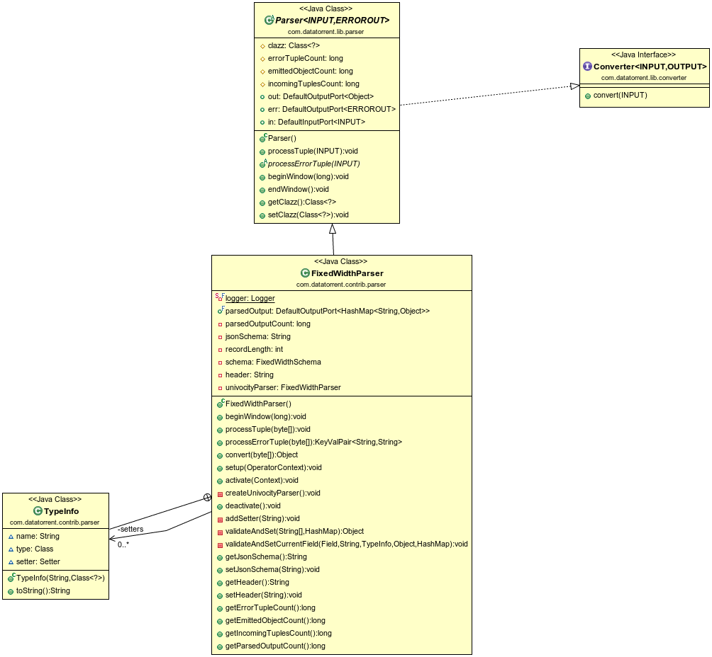

Fixed Width Parser Operator
=============

## Operator Objective
This operator is designed to parse fixed width records and construct a map or concrete java class also known as ["POJO"](https://en.wikipedia.org/wiki/Plain_Old_Java_Object) out of it. User needs to provide the schema to describe the fixed width data. The incoming records will be parsed according to the schema and either a map or a POJO (or both) is emitted.
Invalid records will be emitted on the error port along with an error message.

**Note**: field names in the schema must match field names of the POJO and must be in the same order as it appears in the incoming data.

FixedWidthParser is **idempotent**, **fault-tolerant** and **statically/dynamically partitionable**.

## Class Diagram


## Operator Information
1. Operator location:**_malhar-contrib_**
2. Available since:**_3.8.0_**
3. Operator state:**_Evolving_**
4. Java Package:[com.datatorrent.contrib.parser.FixedWidthParser](https://github.com/apache/apex-malhar/blob/master/contrib/src/main/java/com/datatorrent/contrib/parser/FixedWidthParser.java)


## <a name="props"></a>Properties of FixedWidthParser

Data in a fixed-width text file is arranged in rows and columns, with one entry per row. Fixed width record is one row in a fixed-width file.  Each column has a fixed width, specified in characters, which determines the maximum amount of data it can contain.  No delimiters are used to separate the fields in the file.  Instead, the data is left- or right- justified in its column as specified by the `alignment` value of the schema and the remaining space is filled by the padding character also specified in the schema, such that the start of a given column can always be specified as an offset from the beginning of a line.

User needs to set the schema which describes fixed width data.

| **Property** | **Description** | **Type** | **Mandatory** | **Default Value** |
| -------- | ----------- | ---- | ------------------ | ------------- |
| *jsonSchema* | [Schema](https://github.com/apache/apex-malhar/blob/master/contrib/src/main/java/com/datatorrent/contrib/parser/FixedWidthSchema.java)  describing fixed width data. Based on schema definition the operator will parse the incoming record to object map and POJO. Valid records will be emitted as POJO / map while invalid ones are emitted on error port with error message. | String | YES | N/A |

User can set this property in `properties.xml` in the following way:

```xml
<property>
    <name>
      dt.application.{ApplicationName}.operator.{OperatorName}.prop.jsonSchema
    </name>
    <value>
    {
      "padding": "_",
      "alignment": "left",
      "fields":
      [
        {
          "name": "adId",
          "type": "Integer",
          "length": "3",
          "padding": "0"
        },
        {
          "name": "campaignId",
          "type": "Integer",
          "length": "3",
          "padding": " "
        },
        {
          "name": "adName",
          "type": "String",
          "length": "10",
          "alignment":"right"
        },
        {
          "name": "bidPrice",
          "type": "Double",
          "length": "3"
        },
        {
          "name": "startDate",
          "type": "Date",
          "format": "yyyy-MM-dd HH:mm:ss",
          "length": "19"
        },
        {
          "name": "endDate",
          "type": "Date",
          "format": "dd/MM/yyyy",
          "length": "10"
        },
        {
          "name": "securityCode",
          "type": "Long",
          "length": "5"
        },
        {
          "name": "active",
          "type": "Boolean",
          "length": "5",
          "trueValue": "true",
          "falseValue": "false"
        },
        {
          "name": "optimized",
          "type": "Boolean",
          "length": "1",
          "trueValue": "y",
          "falseValue": "n"
        },
        {
          "name": "parentCampaign",
          "type": "String",
          "length": "10"
        },
        {
          "name": "weatherTargeted",
          "type": "Character",
          "length": "1"
        }
      ]
    }
    </value>
</property>
```
Where {OperatorName} is the name of the Operator and {ApplicationName} is the name of the application.
As explained earlier padding is a character used to specify padding used in the incoming records to fill the fixed width if required. User has the flexibility to specify a single padding character for the entire file or the user can choose to provide separate padding character for separate fields (columns of the record). The padding value for separate fields (if specified) over rides the padding value (global) (if specified) for the entire file.
Similar to padding character user also has the flexibility to define the alignment of the incoming records, user can choose whether the record is left,centre or right aligned. Note that currently only British spelling for 'centre' is accepted.

The sample json schema for records having 3 fields 'Occupation', 'Age' and 'Gender' with field widths 20,2 and 6, padding characters '#','$' and '@' and alignments 'left', 'centre' and 'right' will be as follows:
```
{
  "fields":
  [
    {
      "name": "Occupation",
      "type": "String",
      "length": "20",
      "padding": "#",
      "alignment":"left"
    },
    {
      "name": "Age",
      "type": "Integer",
      "length": "2",
      "padding": "$",
      "alignment":"centre"
    },
    {
      "name": "Gender",
      "type": "String",
      "length": "6",
      "padding": "@",
      "alignment":"right"
    }
}
```

The corresponding record with values for 'Occupation' as Engineer, 'Age' as 30 and 'Gender' as Male would be as follows:
```
Engineer############30@@Male
```


## Platform Attributes that influences operator behavior

| **Attribute** | **Description** | **Type** | **Mandatory** |
| -------- | ----------- | ---- | ------------------ |
| *TUPLE_CLASS* | TUPLE_CLASS attribute on output port which tells operator the class of POJO which need to be emitted | Class| Yes |

User can set this property in `properties.xml` in the following way:
In the examples below, {OperatorName} is the name of the Operator, {ApplicationName} is the name of the application and "com.datatorrent.tutorial.fixedwidthparser.Ad" is the fully qualified name of the Tuple class

```xml
<property>
    <name>dt.application.{ApplicationName}.operator.{OperatorName}.port.out.attr.TUPLE_CLASS</name>
    <value>com.datatorrent.tutorial.fixedwidthparser.Ad</value>
</property>
```

Following code can be added to `populateDAG()` method of application to set Tuple Class:
```java
dag.setOutputPortAttribute({OperatorName}.out, Context.PortContext.TUPLE_CLASS, com.datatorrent.tutorial.fixedwidthparser.Ad.class);
```

## <a name="dataTypes"></a>Supported DataTypes in Schema
  * Integer
  * Long
  * Double
  * Character
  * String
  * Boolean
  * Date
  * Float


## Ports

| **Port** | **Description** | **Type** | **Mandatory** |
| -------- | ----------- | ---- | ------------------ |
| *in* | Tuples that needs to be parsed are received on this port | byte[] | Yes |
| *out* | Valid Tuples that are emitted as pojo | Object (POJO) | No |
| *parsedOutput* | Valid Tuples that are emitted as maps | Map | No |
| *err* | Invalid Tuples are emitted with error message | KeyValPair <String, String\> | No |

## Partitioning
Fixed Width Parser is both statically and dynamically partitionable.
### Static Partitioning

Static partitioning can be achieved by specifying the partitioner and number of partitions in the populateDAG() method.

```java
FixedWidthParser fixedWidthParser = dag.addOperator("fixedWidthParser", FixedWidthParser.class);
StatelessPartitioner<FixedWidthParser> partitioner1 = new StatelessPartitioner<FixedWidthParser>(2);
dag.setAttribute(fixedWidthParser, Context.OperatorContext.PARTITIONER, partitioner1);
```

Static partitioning can also be achieved by specifying the partitioner in properties file.

```xml
<property>
    <name>dt.operator.{OperatorName}.attr.PARTITIONER</name>
    <value>com.datatorrent.common.partitioner.StatelessPartitioner:2</value>
</property>
```

where {OperatorName} is the name of the FixedWidthParser operator. Above lines will partition FixedWidthParser statically 2 times. Above value can be changed accordingly to change the number of static partitions.


### Dynamic Partioning

FixedWidthParser can be dynamically partitioned using out-of-the-box partitioner:

#### Throughput based
Following code can be added to `populateDAG()` method of application to dynamically partition FixedWidthParser:
```java
FixedWidthParser fixedWidthParser = dag.addOperator("fixedWidthParser", FixedWidthParser.class);
StatelessThroughputBasedPartitioner<FixedWidthParser> partitioner = new StatelessThroughputBasedPartitioner<>();
partitioner.setCooldownMillis(conf.getLong("dt.cooldown", 10000));
partitioner.setMaximumEvents(conf.getLong("dt.maxThroughput", 30000));
partitioner.setMinimumEvents(conf.getLong("dt.minThroughput", 10000));
dag.setAttribute(fixedWidthParser, OperatorContext.STATS_LISTENERS, Arrays.asList(new StatsListener[]{partitioner}));
dag.setAttribute(fixedWidthParser, OperatorContext.PARTITIONER, partitioner);
```

Above code will dynamically partition FixedWidthParser when the throughput changes.
If the overall throughput of FixedWidthParser goes beyond 30000 or less than 10000, the platform will repartition FixedWidthParser
to balance throughput of a single partition to be between 10000 and 30000.
CooldownMillis of 10000 will be used as the threshold time for which the throughput change is observed.

## Example
Example for Fixed Width Parser can be found at: [https://github.com/DataTorrent/examples/tree/master/tutorials/parser](https://github.com/DataTorrent/examples/tree/master/tutorials/parser)
