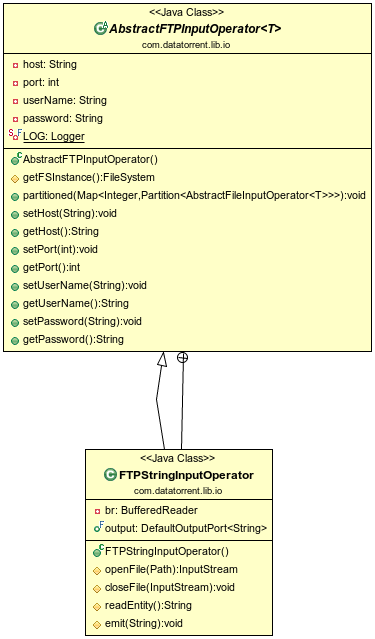

FTP Input Operator
=============

## Operator Objective
This operator(`AbstractFTPInputOperator`) is designed to scan a directory from an FTP server for files, read
and split file content into tuples such as lines or blocks of bytes, and finally
emit them on the output port for further processing by downstream operators.
The operator extends the `AbstractFileInputOperator`. It overrides the
getFSInstance() method and returns an instance of the FTPFileSystem
(`org.apache.hadoop.fs.ftp.FTPFileSystem`)

## Class Diagram


## Operator Information
1. Operator location : **_malhar-lib_**
2. Available since : **_2.0.0_**
3. Java Package : [com.datatorrent.lib.io](https://github.com/apache/apex-malhar/blob/master/library/src/main/java/com/datatorrent/lib/io/AbstractFTPInputOperator.java)

### Ports
Because this is an input operator, there are no input ports.


| Port  | Description | Type | Mandatory |
| -------  | -------- | ----- | ------- |
| *output* | output port on which data is emitted | String | Yes |


### Configuration

| Property | Description | Type | Mandatory | Default Value |
| -------  | -------  | -------  | -------  | -------  |
| *host* | the hostname of the FTP Server | String | Yes | N/A |
| *source* | the directory path from where to scan and read files | String | Yes | N/A |
| *username* | the username for authenticating against the FTP server. This is an optional property and can be skipped when anonymous FTP is enabled | String | Yes | N/A |
| *password* | the password to be used in conjunction with the above username | String | Yes | N/A |

## Partitioning
#### Static Partitioning
Configure parameter `partitionCount` to define the desired number of initial partitions
(4 in this example).

```xml
<property>
  <name>dt.operator.{OperatorName}.prop.partitionCount</name>
  <value>4</value>
</property>
```
Alternatively, this can be changed in the application code by setting the operator property `partitionCount` to the desired number of partitions:

```java
FTPStringInputOperator reader = dag.addOperator("Reader", new FTPStringInputOperator());
reader.setPartitionCount(4);
```

#### Dynamic Partitioning
Dynamic partitioning -- changing the number of partitions of one or more operators
in a running application -- can be achieved in multiple ways:
- Use the command line tool `apex` or the UI console to change the value of the
  `partitionCount` property of the running operator. This change is detected in
  `processStats()` (which is invoked periodically by the platform) where, if the
  current partition count (`currentPartitions`) and the desired partition count
  (`partitionCount`) differ, the `repartitionRequired` flag in the response is set.
  This causes the platform to invoke `definePartitions()` to create a new set of
  partitions with the desired count.
- Override `processStats()` and within it, based on the statistics in the
  incoming parameter or any other factors, define a new desired value of
  `partitionCount` and finally, if this value differs from the current partition
  count, set the `repartitionRequired` flag in the response.

### Example application
An example application for the FTP input operator can be found at [https://github.com/apache/apex-malhar/tree/master/examples/ftp](https://github.com/apache/apex-malhar/tree/master/examples/ftp)
