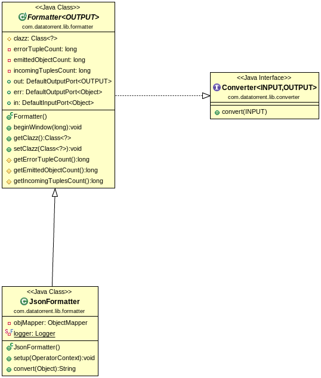

Json Formatter
=============

## Operator Objective
Purpose of JsonFormatter is to consume Plain Old Java Object ("POJO") and write them as JSON.
Json Formatter is **idempotent**, **fault-tolerance** & **statically/dynamically partitionable**.

## Class Diagram

## Operator Information
1. Operator location:**_malhar-library**
2. Available since:**_3.2.0_**
3. Operator state:**_Evolving_**
4. Java Package:[com.datatorrent.lib.formatter.JsonFormatter](https://github.com/apache/apex-malhar/blob/master/library/src/main/java/com/datatorrent/lib/formatter/JsonFormatter.java)

## Properties, Attributes and Ports

### Platform Attributes that influences operator behavior
| **Attribute** | **Description** | **Type** | **Mandatory** |
| -------- | ----------- | ---- | ------------------ |
| *in.TUPLE_CLASS* | TUPLE_CLASS attribute on input port which tells operator the class of incoming POJO | Class or FQCN| Yes |


### Ports
| **Port** | **Description** | **Type** | **Mandatory** |
| -------- | ----------- | ---- | ------------------ |
| *in*  | Tuples that needs to be formatted are recieved on this port | Object (POJO) | Yes
| *out* | Valid Tuples that are emitted as JSON | String | No |
| *err* | Invalid Tuples are emitted on this port | Object | No |

## Partitioning
JSON Formatter is both statically and dynamically partitionable.
### Static Partitioning
This can be achieved in 2 ways

1. Specifying the partitioner and number of partitions in the populateDAG() method

```java
JsonFormatter jsonFormatter = dag.addOperator("jsonFormatter", JsonFormatter.class);
StatelessPartitioner<JsonFormatter> partitioner1 = new StatelessPartitioner<JsonFormatter>(2);
dag.setAttribute(jsonFormatter, Context.OperatorContext.PARTITIONER, partitioner1 );
```
2. Specifying the partitioner in properties file.
```xml
 <property>
   <name>dt.operator.{OperatorName}.attr.PARTITIONER</name>
   <value>com.datatorrent.common.partitioner.StatelessPartitioner:2</value>
 </property>
```
 where {OperatorName} is the name of the JsonFormatter operator.
 Above lines will partition JsonFormatter statically 2 times. Above value can be changed accordingly to change the number of static partitions.


### Dynamic Paritioning

JsonFormatter can be dynamically partitioned using an out-of-the-box partitioner:

#### Throughput based
Following code can be added to populateDAG method of application to dynamically partition JsonFormatter:
```java
JsonFormatter jsonFormatter = dag.addOperator("jsonFormatter", JsonFormatter.class);
StatelessThroughputBasedPartitioner<JsonFormatter> partitioner = new StatelessThroughputBasedPartitioner<>();
partitioner.setCooldownMillis(conf.getLong(COOL_DOWN_MILLIS, 10000));
partitioner.setMaximumEvents(conf.getLong(MAX_THROUGHPUT, 30000));
partitioner.setMinimumEvents(conf.getLong(MIN_THROUGHPUT, 10000));
dag.setAttribute(JsonFormatter, OperatorContext.STATS_LISTENERS, Arrays.asList(new StatsListener[]{partitioner}));
dag.setAttribute(JsonFormatter, OperatorContext.PARTITIONER, partitioner);
```

Above code will dynamically partition JsonFormatter when the throughput changes.
If the overall throughput of JsonFormatter goes beyond 30000 or less than 10000, the platform will repartition JsonFormatter
to balance throughput of a single partition to be between 10000 and 30000.
CooldownMillis of 10000 will be used as the threshold time for which the throughput change is observed.

## Example
Example for Json Formatter can be found at: [https://github.com/DataTorrent/examples/tree/master/tutorials/parser](https://github.com/DataTorrent/examples/tree/master/tutorials/parser)

## Advance Features
JsonFormatter is based on [jackson-databind](https://github.com/FasterXML/jackson-databind) and so users can make use of [annotations](https://github.com/FasterXML/jackson-annotations) in POJO class. Here are few annotations that are relavant while using JsonFormatter
1. **@JsonProperty** : Sometimes POJOs contain properties that has different name from incoming POJOs.You can specify names as:
```java
public class Ad{
  @JsonProperty("desc")
  public String description;
  public List<String> sizes;
}
```
2. **@JsonIgnore** : Sometimes POJOs contain properties that you do not want to write out, so you can do:
```java
public class Value {
  public int value;
  @JsonIgnore
  public int internalValue;
}
```
3. **@JsonFormat** :  Sometimes Date fields need to be printed in custom format, so you can do:
```java
public class Ad{
  @JsonFormat(shape = JsonFormat.Shape.STRING, pattern = "EEE, d MMM yyyy HH:mm:ss")
   public Date startDate;
}
```
