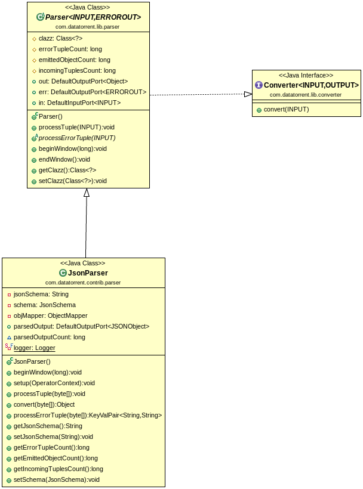

Json Parser
=============

## Operator Objective
Purpose of JsonParser operator is to parse JSON records and construct a Plain Old Java Object ("POJO") out of it. The operator also emits each record as JSONObject if the relevant output port is connected. User can also provide a schema describing JSON data to validate incoming JSON records. Valid records will be emitted as POJO / JSONObject while invalid ones are emitted on error port with the error message if the error port is connected.

Json Parser is **idempotent**, **fault-tolerant** & **statically/dynamically partitionable**.

## Class Diagram

## Operator Information
1. Operator location:**_malhar-contrib_**
2. Available since:**_3.2.0_**
3. Operator state:**_Evolving_**
4. Java Package:[com.datatorrent.contrib.parser.JsonParser](https://github.com/apache/apex-malhar/blob/master/contrib/src/main/java/com/datatorrent/contrib/parser/JsonParser.java)

## Properties, Attributes and Ports
### <a name="props"></a>Properties of Json Parser
| **Property** | **Description** | **Type** | **Mandatory** | **Default Value** |
| -------- | ----------- | ---- | ------------------ | ------------- |
| *jsonSchema* | [Schema](http://json-schema.org/)  describing JSON data. Incoming records can be validated using the jsonSchema. If the data is not as per the requirements specified in jsonSchema, they are emitted on the error port.This is an optional property. If the schema is not provided, incoming tuples are simply converted to POJO or JSONObject without any validations| String | NO | N/A |

### Platform Attributes that influences operator behavior
| **Attribute** | **Description** | **Type** | **Mandatory** |
| -------- | ----------- | ---- | ------------------ |
| *out.TUPLE_CLASS* | TUPLE_CLASS attribute on output port which tells operator the class of POJO which needs to be emitted. The name of the field members of the class must match with the names in incoming POJO. The operator ignores unknown properties.| Class or FQCN| Yes |


### Ports
| **Port** | **Description** | **Type** | **Mandatory** |
| -------- | ----------- | ---- | ------------------ |
| *in*  | Tuples that needs to be parsed are recieved on this port | byte[] | Yes
| *out* | Valid Tuples that are emitted as pojo. Tuples are converted to POJO only if the port is connected. | Object (POJO) | No |
| *parsedOutput* | Valid Tuples that are emitted as JSONObject. Tuples are converted to JSONObject only if the port is connected.| JSONObject | No |
| *err* | Invalid Tuples are emitted with error message. Invaid tuples are discarded if the port is not connected. | KeyValPair <String, String\> | No |

## Partitioning
JSON Parser is both statically and dynamically partitionable.
### Static Partitioning
This can be achieved in 2 ways

1. Specifying the partitioner and number of partitions in the populateDAG() method

```java
JsonParser jsonParser = dag.addOperator("jsonParser", JsonParser.class);
StatelessPartitioner<JsonParser> partitioner1 = new StatelessPartitioner<JsonParser>(2);
dag.setAttribute(jsonParser, Context.OperatorContext.PARTITIONER, partitioner1 );
```
2. Specifying the partitioner in properties file.
```xml
 <property>
   <name>dt.operator.{OperatorName}.attr.PARTITIONER</name>
   <value>com.datatorrent.common.partitioner.StatelessPartitioner:2</value>
 </property>
```
 where {OperatorName} is the name of the JsonParser operator.
 Above lines will partition JsonParser statically 2 times. Above value can be changed accordingly to change the number of static partitions.


### Dynamic Paritioning

JsonParser can be dynamically partitioned using an out-of-the-box partitioner:

#### Throughput based
Following code can be added to populateDAG method of application to dynamically partition JsonParser:
```java
JsonParser jsonParser = dag.addOperator("jsonParser", JsonParser.class);
StatelessThroughputBasedPartitioner<JsonParser> partitioner = new StatelessThroughputBasedPartitioner<>();
partitioner.setCooldownMillis(conf.getLong(COOL_DOWN_MILLIS, 10000));
partitioner.setMaximumEvents(conf.getLong(MAX_THROUGHPUT, 30000));
partitioner.setMinimumEvents(conf.getLong(MIN_THROUGHPUT, 10000));
dag.setAttribute(jsonParser, OperatorContext.STATS_LISTENERS, Arrays.asList(new StatsListener[]{partitioner}));
dag.setAttribute(jsonParser, OperatorContext.PARTITIONER, partitioner);
```

Above code will dynamically partition JsonParser when the throughput changes.
If the overall throughput of JsonParser goes beyond 30000 or less than 10000, the platform will repartition JsonParser
to balance throughput of a single partition to be between 10000 and 30000.
CooldownMillis of 10000 will be used as the threshold time for which the throughput change is observed.


## Example
Example for Json Parser can be found at: [https://github.com/DataTorrent/examples/tree/master/tutorials/parser](https://github.com/DataTorrent/examples/tree/master/tutorials/parser)
