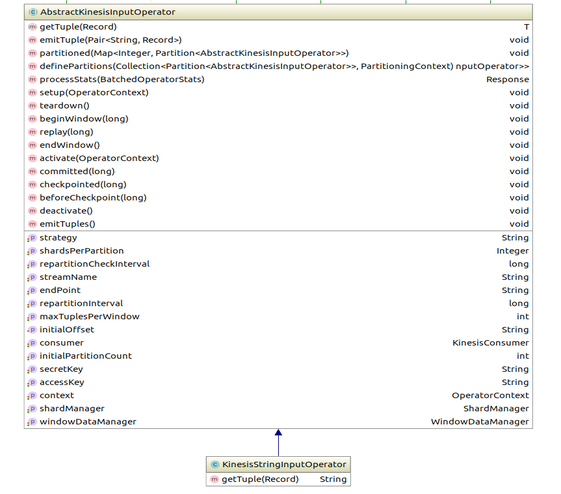

KINESIS INPUT OPERATOR
=====================

### Introduction

The kinesis input operator consumes data from the partitions of a Kinesis shard(s) for processing in Apex. 
The operator is fault-tolerant, scalable and supports input from multiple shards of AWS kinesis streams in a single operator instance.

### Kinesis Input Operator

Package: `com.datatorrent.contrib.kinesis`

Maven artifact: [malhar-contrib](https://mvnrepository.com/artifact/org.apache.apex/malhar-contrib)

### Pre-requisites

This operator uses the AWS kinesis java sdk version 1.9.10.

### AbstractKinesisInputOperator

This is the abstract implementation that serves as base class for consuming records from AWS Kinesis streams.



#### Configuration properties

-   ***accessKey*** - String[]
    -   Mandatory Parameter.
    -   Specifies the AWS credentials AccessKeyId.
    
-   ***secretKey*** - String[]
    -   Mandatory Parameter.
    -   Specifies the AWS credentials SecretAccessKey.

-   ***streamName*** - String[]
    -   Mandatory Parameter.
    -   Specifies the name of the stream from where the records to be accessed.
    
-   ***strategy*** - PartitionStrategy
    -   Operator supports two types of partitioning strategies, `ONE_TO_ONE` and `MANY_TO_ONE`.
    
        `ONE_TO_ONE`: If this is enabled, the AppMaster creates one input operator instance per kinesis shard partition. So the number of shard partitions equals the number of operator instances.
        `MANY_TO_ONE`: The AppMaster creates K = min(initialPartitionCount, N) Kinesis input operator instances where N is the number of shard partitions. If K is less than N, the remaining shard partitions are assigned to the K operator instances in round-robin fashion. If K is less than initialPartitionCount, the AppMaster creates one input operator instance per shard partition. For example, if initialPartitionCount = 5 and number of shard partitions(N) = 2 then AppMaster creates 2 Kinesis input operator instances.
        Default Value = `PartitionStrategy.ONE_TO_ONE`.

-   ***initialPartitionCount*** - Integer
    -   When the MANY_TO_ONE partition strategy is enabled, this value indicates the number of Kinesis input operator instances. 
        Default Value = 1.

-   ***initialOffset*** - InitialOffset
    -   Indicates the type of offset i.e, `EARLIEST` or `LATEST`. 
        `LATEST` => Consume new record(s) from latest offset in the shard. 
        `EARLIEST` => Consume all record(s) available in the shard.
        Default value = `InitialOffset.LATEST`
        
-   ***repartitionInterval*** - Long
    -   Interval specified in milliseconds. This value specifies the minimum time required between two repartition actions. 
        Default Value = 30 Seconds.

-   ***repartitionCheckInterval*** - Long
    -   Interval specified in milliseconds. This value specifies the minimum interval between two stat checks.
        Default Value = 5 Seconds.

-   ***maxTuplesPerWindow*** - Integer
    -   Controls the maximum number of records emitted in each streaming window from this operator. Minimum value is 1. 
        Default value = `MAX_VALUE`

-   ***holdingBufferSize*** - Long
    -   Indicates the maximum number of messages kept in memory for emitting.
        Default value = 1024.

-   ***windowDataManager*** - WindowDataManager
    -   If set to a value other than the default, such as `FSWindowDataManager`, specifies that the operator will process the same set of messages in a window before and after a failure. This is important but it comes with higher cost because at the end of each window the operator needs to persist some state with respect to that window.
        Default value = `WindowDataManager.NoopWindowDataManager`.

#### Abstract Methods

`T getTuple(Record record)`: Converts the Kinesis Stream record(s) to tuple.
`void emitTuple(Pair<String, Record> data)`: This method emits tuples extracted from AWS kinesis streams.

#### Ports

`outputPort <T>`: Tuples extracted from Kinesis streams in form of records are emitted through this port.

### KinesisConsumer

This is an abstract implementation of Kinesis consumer. It sends the fetch
requests from AWS kinesis streams to Kinesis partitions. For each request,
it receives the set of records and stores them into the buffer which is
ArrayBlockingQueue.


### ShardManager

This is an interface for offset management and is useful when consuming data
from specified offsets. Updates the offsets for all the kinesis partitions
periodically. Below is the code snippet:

```java
public class ShardManager
{
  public Map<String, String> loadInitialShardPositions();
  public Map<String, String> loadInitialShardPositions();
  public void updatePositions(Map<String, String> shardPositions);
}
```

### Partitioning

The logical instance of the KinesisInputOperator acts as the Partitioner
as well as a StatsListener. This is because the
AbstractKinesisInputOperator implements both the
com.datatorrent.api.Partitioner and com.datatorrent.api.StatsListener
interfaces and provides an implementation of definePartitions(...) and
processStats(...) which makes it auto-scalable.

#### Response processStats(BatchedOperatorStats stats)

The application master invokes this method on the logical instance with
the stats (tuplesProcessedPS, bytesPS, etc.) of each partition.
Re-partitioning happens based on whether any new Kinesis streams are added/modified 
or based on kinesis shards stats with respective upper bounds.

#### DefinePartitions

Based on the repartitionRequired field of the Response object which is
returned by processStats(...) method, the application master invokes
definePartitions(...) on the logical instance which is also the
partitioner instance. Dynamic partition can be disabled by setting the
parameter repartitionInterval value to a negative value.


#### KinesisStringInputOperator
This class extends from AbstractKinesisInputOperator and defines the `getTuple()` method which extracts byte array from Kinesis record.

#### Ports
`outputPort <byte[]>`: Tuples extracted from Kinesis Streams are emitted through this port.

### Application Example

This section builds an Apex application using Kinesis input operator.
Below is the code snippet:

```java
@ApplicationAnnotation(name="KinesisApp")
public class ExampleApplication implements StreamingApplication
{

  @Override
  public void populateDAG(DAG dag, Configuration conf)
  {
    KinesisStringInputOperator inputOperator = dag.addOperator("kinesisInput", new KinesisStringInputOperator());
    ConsoleOutputOperator outputOperator = dag.addOperator("Console", new ConsoleOutputOperator());
    dag.addStream("kinesis-to-console", inputOperator.outputPort, outputOperator.input);
  }
}
```
Below is the configuration for “KINESIS-STREAM-NAME” Kinesis stream name:

```xml
<property>
  <name>dt.operator.kinesisInput.prop.streamName</name>
  <value>KINESIS-STREAM-NAME</value>
</property>
<property>
  <name>dt.operator.kinesisInput.prop.accessKey</name>
  <value>ACCESSKEY</value>
</property>
<property>
  <name>dt.operator.kinesisInput.prop.secretKey</name>
  <value>SECRETKEY</value>
</property>
<property>
  <name>dt.operator.kinesisInput.prop.endPoint</name>
  <value>ENDPOINT</value>
</property>
```
For a full example application project, refer to https://github.com/DataTorrent/examples/tree/master/tutorials/kinesisInput
