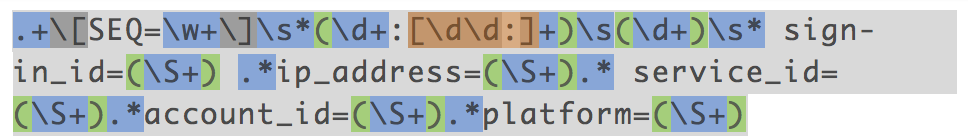
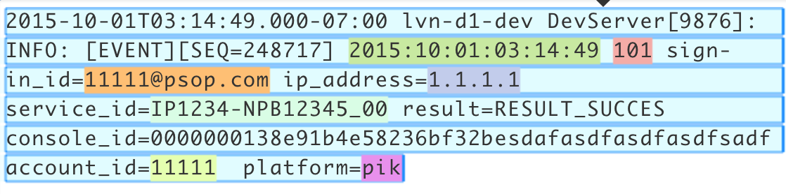

Regex Parser Operator
=====================

## Operator Objective
**RegexParser** is designed to parse records based on a regex pattern and construct a concrete java class also known as ["POJO"](https://en.wikipedia.org/wiki/Plain_Old_Java_Object) out of it. User needs to provide the regex pattern and schema definition to describe the data pattern. Based on regex pattern, the operator will split the data and then schema definition will be used to map the incoming record to POJO. User can also provide date format if any, in the schema. The supported constraints are listed in [constraints table](#constraints).

The regex pattern has to match the tuple in its entirety. Valid records will be emitted as POJOs while invalid ones are emitted on the error port with an error message if the corresponding ports are connected.

**Note**: field names of POJO must match field names in schema and in the same order as it appears in the incoming data.

## Overview
The operator is **idempotent**, **fault-tolerant** and **partitionable**.

## Operator Information
1. Operator location: **_malhar-contrib_**
2. Available since: **_3.7.0_**
3. Operator state: **_Evolving_**
4. Java Package: [com.datatorrent.contrib.parser.RegexParser](https://github.com/apache/apex-malhar/blob/master/contrib/src/main/java/com/datatorrent/contrib/parser/RegexParser.java)


## <a name="props"></a>Properties of RegexParser
User needs to set the `schema` JSON string which describes data as well as specify the format on date fields if any.
**Note**: In the examples below {ApplicationName} and {OperatorName} are placeholders for the respective names of the application and the operator.

e.g.

```xml
    <property>
        <name>dt.application.{ApplicationName}.operator.{OperatorName}.prop.schema</name>
        <value>{
                 "fields": [
                   {
                     "name": "date",
                     "type": "Date",
                     "constraints": {
                       "format": "yyyy:MM:dd:hh:mm:ss"
                     }
                   },
                   {
                     "name": "id",
                     "type": "Integer"
                   },
                   {
                     "name": "signInId",
                     "type": "String"
                   },
                   {
                     "name": "ipAddress",
                     "type": "String"
                   },
                   {
                     "name": "serviceId",
                     "type": "Double"
                   },
                   {
                     "name": "accountId",
                     "type": "Long"
                   },
                   {
                     "name": "platform",
                     "type": "Boolean"
                   }
                 ]
               }
        </value>
    </property>
```

Note that `Boolean` type in the above example accepts case insensitive values for either true or false.

User needs to set the `splitRegexPattern` property whose value is the regular expression that describes the pattern of the incoming data.
Below is the example for setting `splitRegexPattern` from `properties.xml` of the application.

```xml
    <property>
        <name>dt.application.{ApplicationName}.operator.{OperatorName}.prop.splitRegexPattern</name>
        <value>.+\[SEQ=\w+\]\s*(\d+:[\d\d:]+)\s(\d+)\s* sign-in_id=(\S+) .*ip_address=(\S+).* service_id=(\S+).*account_id=(\S+).*platform=(\S+)</value>
    </property>
```

| **Property** | **Description** | **Type** | **Mandatory** | **Default Value** |
| -------- | ----------- | ---- | ------------------ | ------------- |
| *schema* | [Schema](https://github.com/apache/apex-malhar/blob/master/contrib/src/main/java/com/datatorrent/contrib/parser/DelimitedSchema.java)  describing data (see example above) | String | YES | N/A |
| *splitRegexPattern* | regex expression that describes the pattern of incoming data | String | YES | N/A |


## Platform Attributes that influence operator behavior

| **Attribute** | **Description** | **Type** | **Mandatory** |
| -------- | ----------- | ---- | ------------------ |
| *TUPLE_CLASS* | TUPLE_CLASS attribute on output port which tells operator the class of POJO which need to be emitted | Class| Yes |

The operator takes care of converting the byte array received on the input port to a string by decoding using the JVM's default `Charset`. Then, splits the string using the `splitRegexPattern` and populates an object using the `schema`. Apex platform converts this object to the object of `TUPLE_CLASS` attribute value while emitting.

Below is the example for setting `TUPLE_CLASS` attribute on output port from `properties.xml` file of the application.

```xml
    <property>
        <name>dt.application.{ApplicationName}.operator.{OperatorName}.port.out.attr.TUPLE_CLASS</name>
        <value>com.datatorrent.tutorial.regexparser.ServerLog</value>
    </property>
```

Below is the example for setting `TUPLE_CLASS` attribute on output port from `Application.java` file of the application.

```java
RegexParser regexParser = dag.addOperator("regexParser", RegexParser.class);
dag.setOutputPortAttribute(regexParser.out, Context.PortContext.TUPLE_CLASS, ServerLog.class);
```

where the value (ServerLog) set above is the expected output POJO class from the operator and example is as below.

```java
    public class ServerLog
    {
      private Date date;
      private int id;
      private String signInId;
      private String ipAddress;
      private double serviceId;
      private long accountId;
      private boolean platform;
      public int getId()
      {
        return id;
      }
      public void setId(int id)
      {
        this.id = id;
      }
      public Date getDate()
      {
        return date;
      }
      public void setDate(Date date)
      {
        this.date = date;
      }
      public String getSignInId()
      {
        return signInId;
      }
      public void setSignInId(String signInId)
      {
        this.signInId = signInId;
      }
      public String getIpAddress()
      {
        return ipAddress;
      }
      public void setIpAddress(String ipAddress)
      {
        this.ipAddress = ipAddress;
      }
      public double getServiceId()
      {
        return serviceId;
      }
      public void setServiceId(double serviceId)
      {
        this.serviceId = serviceId;
      }
      public long getAccountId()
      {
        return accountId;
      }
      public void setAccountId(long accountId)
      {
        this.accountId = accountId;
      }
      public boolean getPlatform()
      {
        return platform;
      }
      public void setPlatform(boolean platform)
      {
        this.platform = platform;
      }
    }
```

Let us look at how the data gets populated into the POJO using the example `schema`, `splitRegexPattern` and `TUPLE_CLASS` definitions given above.

Consider sample event log as below that matches with the `splitRegexPattern`.

```
2015-10-01T03:14:49.000-07:00 lvn-d1-dev DevServer[9876]: INFO: [EVENT][SEQ=248717] 2015:10:01:03:14:49 101 sign-in_id=11111@psop.com ip_address=1.1.1.1  service_id=IP1234-NPB12345_00 result=RESULT_SUCCES console_id=0000000138e91b4e58236bf32besdafasdfasdfasdfsadf  account_id=11111  platform=pik
```

The below images depict the expression match on the data. The parentheses corresponding to [capturing groups](https://docs.oracle.com/javase/8/docs/api/java/util/regex/Pattern.html#cg) are highlighted in green and each such group corresponds to one field of the POJO. There will be 7 such groups in the current example.



The matched data in the event log is highlighted with 7 different colors below.



The matched fields above will be populated onto an object based on the `schema` definition defined above. Object population will be based on one to one mapping from matched data to `schema` definition fields in the match order. Once the object is populated, it will be converted to the `TUPLE_CLASS` type while emitting on the output port `out` by the Apex platform.

## <a name="dataTypes"></a>Supported DataTypes in Schema
  * Integer
  * Long
  * Double
  * Character
  * String
  * Boolean
  * Date
  * Float

## <a name="constraints"></a>Schema Constraints

Only Date constraints are supported by the operator as of now.

|**DataType**| **Constraints** | **Description** |
| -------- | -------- | -------- |
| *Date* | format | A simple date format as specified in the [SimpleDateFormat](http://docs.oracle.com/javase/8/docs/api/java/text/SimpleDateFormat.html?is-external=true) class |

## Ports

| **Port** | **Description** | **Type** | **Mandatory** |
| -------- | ----------- | ---- | ------------------ |
| *in* | Tuples that needs to be parsed are received on this port | byte[] | Yes |
| *out* | Valid tuples that are emitted as POJO | Object (POJO) | No |
| *err* | Invalid tuples are emitted with error message | KeyValPair <String, String\> | No |

## Partitioning
Regex Parser can be statically or dynamically partitioned.
### Static Partitioning
This can be achieved in the below 2 ways.

Specifying the partitioner and number of partitions in the populateDAG() method.
```java
    RegexParser regexParser = dag.addOperator("regexParser", RegexParser.class);
    StatelessPartitioner<RegexParser> partitioner = new StatelessPartitioner<RegexParser>(2);
    dag.setAttribute(regexParser, Context.OperatorContext.PARTITIONER, partitioner);
```
Specifying the partitioner in properties file.
```xml
    <property>
        <name>dt.application.{ApplicationName}.operator.{OperatorName}.attr.PARTITIONER</name>
        <value>com.datatorrent.common.partitioner.StatelessPartitioner:2</value>
    </property>
```

Above lines will partition RegexParser statically 2 times. Above value can be changed accordingly to change the number of static partitions.


### Dynamic Partitioning
RegexParser can be dynamically partitioned using the out-of-the-box partitioner:

#### Throughput based
Following code can be added to the `populateDAG` method of application to dynamically partition RegexParser:
```java
    RegexParser regexParser = dag.addOperator("regexParser", RegexParser.class);
    StatelessThroughputBasedPartitioner<RegexParser> partitioner = new StatelessThroughputBasedPartitioner<>();
    partitioner.setCooldownMillis(conf.getLong(COOL_DOWN_MILLIS, 10000));
    partitioner.setMaximumEvents(conf.getLong(MAX_THROUGHPUT, 30000));
    partitioner.setMinimumEvents(conf.getLong(MIN_THROUGHPUT, 10000));
    dag.setAttribute(regexParser, OperatorContext.STATS_LISTENERS, Arrays.asList(new StatsListener[]{partitioner}));
    dag.setAttribute(regexParser, OperatorContext.PARTITIONER, partitioner);
```

Above code will dynamically partition RegexParser when the throughput changes.
If the overall throughput of regexParser goes beyond 30000 or less than 10000, the platform will repartition RegexParser
to balance throughput of a single partition to be between 10000 and 30000.
CooldownMillis of 10000 will be used as the threshold time for which the throughput change is observed.

## Example

Coming Soon
