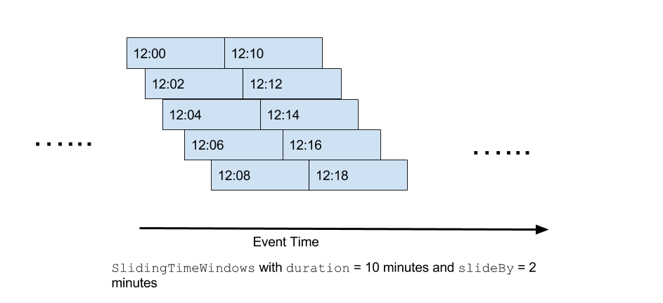
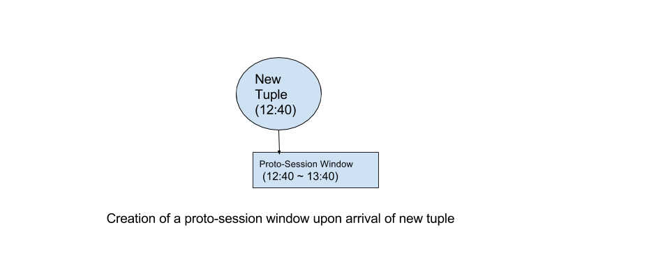
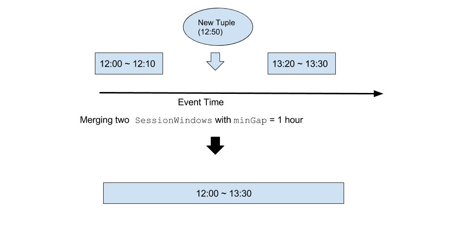
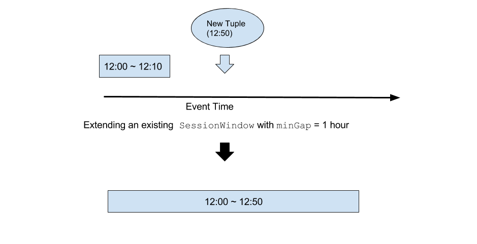
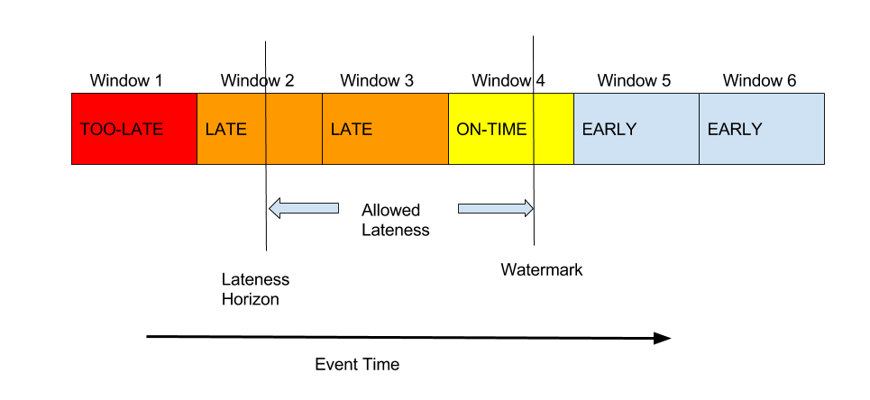

# WINDOWED OPERATOR

## Introduction

The `WindowedOperator` is an operator in the Apex Malhar Library that supports the windowing semantics outlined by Apache Beam, including the notions of watermarks, triggers, accumulation modes, and allowed lateness. It currently supports event time windows, sliding event time windows, session windows, and global window. The reader of this document is encouraged to read this [blog](https://www.oreilly.com/ideas/the-world-beyond-batch-streaming-101) for the basic concepts of streaming applications, and this [blog](https://www.oreilly.com/ideas/the-world-beyond-batch-streaming-102) for Apache Beam's windowing semantics before using this operator.

Our High-Level API supports event-time processing through the WindowedOperator. If you'd like to process tuples based on event time, you are encouraged to use this operator either directly with our DAG-level API, or indirectly through our High-Level API.

It is important to note that the word "windows" in this document is unrelated to "streaming windows" or "application windows" in Apex, which are based on ingression time. For more information about "streaming windows" and "application windows" in Apex, please refer to [this document](http://apex.apache.org/docs/apex/application_development/#streaming-window).

## Operator Overview

In this document, we will explore the following features in the WindowedOperator.

1. Keyed or Not Keyed
2. Window Option
3. Timestamp Extractor
4. Watermarks
5. Allowed Lateness
6. Accumulation
7. Triggers
8. Accumulation Mode
9. Window Propagation
10. Merging two streams

## Keyed or Not Keyed

One of the first things the user of the operator has to decide is whether the operator is keyed ([KeyedWindowedOperatorImpl](https://github.com/apache/apex-malhar/blob/master/library/src/main/java/org/apache/apex/malhar/lib/window/impl/KeyedWindowedOperatorImpl.java)) or not keyed ([WindowedOperatorImpl](https://github.com/apache/apex-malhar/blob/master/library/src/main/java/org/apache/apex/malhar/lib/window/impl/WindowedOperatorImpl.java)). State storage, accumulation and triggers behave differently based on whether or not the operator is keyed.

Here are examples of creating a windowed operator.

Non-keyed:
```java
// Creating a non-keyed windowed operator
WindowedOperatorImpl<InputType, AccumulationType, OutputType> windowedOperator = new WindowedOperatorImpl<>();
```

Keyed:
```java
// Creating a keyed windowed operator
KeyedWindowedOperatorImpl<KeyType, InputValueType, AccumulationType, OutputValueType> windowedOperator = new KeyedWindowedOperatorImpl<>();
```


We will cover the concepts of [state storage](#state_storage), [accumulation](#accumulation) and [triggers](#triggers) later in this document.

## Window Option

Each incoming tuple of the WindowedOperator is assigned to one or more windows. The `WindowOption` provides the way to specify what constitutes a window. The following `WindowOption`s are supported.

### `GlobalWindow`

There is only one window for the entire duration of the application. All tuples are assigned to this one window.

```java
// Setting the global window option
windowedOperator.setWindowOption(new WindowOption.GlobalWindow());
```

### `TimeWindows`

A tuple is assigned to exactly one window based on event time, and each window has a fixed duration. One window is followed immediately by another window, and they do not overlap. As a result, one timestamp can only belong to one window.

 

```java
// Setting a time window option with a duration of 10 minutes
windowedOperator.setWindowOption(new WindowOption.TimeWindows(Duration.standardMinutes(10)));
```

### `SlidingTimeWindows`

Similar to `TimeWindow`, each window has a fixed duration. But it takes an additional duration parameter `slideBy` which must be smaller than the window duration and the window duration must be divisible by the `slideBy` duration. Each window overlaps with multiple windows. In this case, since one timestamp belongs to multiple windows, a tuple is assigned to multiple windows. The number of windows a tuple belongs to is exactly the window duration divided by the `slideBy` duration.

 

```java
// Setting a sliding time window option with a duration of 10 minutes and a slideBy duration of 2 minutes
windowedOperator.setWindowOption(new WindowOption.TimeWindows(Duration.standardMinutes(10)).slideBy(Duration.standardMinutes(2)));
```

### `SessionWindows`

`SessionWindow`s have variable durations and are based on the key of the tuple. Each tuple is assigned to exactly one window. It takes a duration parameter `minGap`, which specifies the minimum time gap between two tuples that belong to two *different* `SessionWindows` of the same key. `minGap` is also the duration of the "proto-session" window for a single timestamp, and it is the minimum duration of any session window.

```java
// Setting a session window option with a minimum gap of one hour
windowedOperator.setWindowOption(new WindowOption.SessionWindows(Duration.standardHours(1)));
```

Upon arrival of a tuple, a proto-session window is created. A proto-session window for a tuple is a temporary session window with begin timestamp being the tuple timestamp and the duration being `minGap`.



To ensure that there are no two tuples of the same key in different session windows that are less than `minGap` apart, the `WindowedOperator` does the following checks:

#### The proto-session window can be fit into an existing `SessionWindow` of the same key without change

The new tuple is simply applied to the state of the existing `SessionWindow`.


#### The proto-session window overlaps with two existing session windows of the same key

A new Session Window is created with the merged state of the two existing `SessionWindow`s, plus the new tuple. The two existing `SessionWindow`s will be deleted and retraction triggers for the two deleted windows will be fired. (Please see [here](#triggers) for details on `Trigger`s)

 

#### The proto-session window overlaps with one existing session window of the same key

A new `SessionWindow` is created with the state of the existing `SessionWindow`, plus the new tuple, with a longer duration than the existing `SessionWindow` and possibly an earlier begin timestamp to cover the new tuple. The existing `SessionWindow` will be deleted and a retraction trigger for the old window will be fired.

 

#### All of the above checks return false

The proto-session window is in effect and the new tuple is assigned to that window.

## Timestamp Extractor

The `WindowedOperator` expects a timestamp extractor. This is for `WindowedOperator` to extract the timestamp from the tuple for window assignment.

```java
// Setting a time extractor
windowedOperator.setTimestampExtractor(new Function<InputTupleType, Long>()
{
  @Override
  public Long apply(InputTupleType tuple)
  {
    return tuple.timestamp;
  }
});

```

## Watermarks

Watermarks are control tuples that include a timestamp. A watermark tells `WindowedOperator` that all windows that lie completely before the given timestamp are considered late, and the rest of the windows are considered early. 

### Fixed Watermark

If watermarks are not available from upstream, the user of the WindowedOperator can set a fixed watermark. The fixed watermark represents the number of milliseconds before the timestamp derived from the Apex streaming window ID. Note that the Apex streaming window ID is an implicit timestamp that more or less represents the ingression time of the tuple.

```java
// Setting a fixed watermark that is 10 seconds behind the ingression time
windowedOperator.setFixedWatermark(10000);
```

## Allowed Lateness

Allowed Lateness specifies the lateness horizon from the watermark. If a tuple has a timestamp that lies beyond the lateness horizon, it is dropped by the `WindowedOperator`. Also, if a window completely lies beyond the lateness horizon as a result of the arrival of a new watermark, the window along with its state is purged from `WindowedOperator`.

 

```java
// Setting allowed lateness to be one hour
windowedOperator.setAllowedLateness(Duration.standardHours(1));
```


## Accumulation

The Accumulation object tells the `WindowedOperator` how the operator state is accumulated. It tells the `WindowedOperator` what to do with its state upon arrival of an incoming tuple. This is where the business logic goes. Please refer to the interface definition [here](https://github.com/apache/apex-malhar/blob/master/library/src/main/java/org/apache/apex/malhar/lib/window/Accumulation.java) in github. For non-keyed WindowedOperator, the state is per window. For keyed WindowedOperator, the state is per key per window.

```java
// Setting the accumulation to be the sum for longs, assuming both the input type and the output type are a long
windowedOperator.setAccumulation(new SumLong());
```

The user of this operator can use one of the existing accumulation implementations [here](https://github.com/apache/apex-malhar/tree/master/library/src/main/java/org/apache/apex/malhar/lib/window/accumulation), or provides their own custom accumulation that reflects their business logic. 

## Triggers

Triggers are tuples emitted to downstream by the `WindowedOperator`. The data in the tuples are based on the state of `WindowedOperator` governed by the Accumulation object. There are two types of trigger: time-based triggers and count-based triggers. Time-based triggers are triggers that get fired in a regular time interval, and count-based triggers are triggers that get fired based on the number of tuples received. The user of WindowedOperator can specify different triggers for windows that are early or late based on the watermark.

Also, by default, a trigger is fired for a window when the window is flipped from being early to being late. This is also called an "on-time" trigger.

```java
// Creating a trigger option that tells the windowed operator to fire a trigger when the window is flipped from early to late, and fire a trigger every 10 seconds when it's early, and fire a trigger every time a tuple is received when it's late
TriggerOption triggerOption = TriggerOption.AtWatermark().withEarlyFiringsAtEvery(Duration.standardSeconds(10)).withLateFiringsAtEvery(1);

// Setting the trigger option for the windowed operator
windowedOperator.setTriggerOption(triggerOption);
```

Note that for the non-keyed `WindowedOperator`, triggers are fired on a per-window basis. For the keyed `WindowedOperator`, triggers are fired on a per-key-per-window basis.

There is also an option the user can set (`fireOnlyUpdatedPanes`) to make the `WindowedOperator` not fire a trigger if the trigger value is the same as the value of the previous trigger. 

```java
// Telling the windowed operator to fire a trigger only if the state has been changed since the last trigger
triggerOption.fireOnlyUpdatedPanes();
```


## Accumulation Mode

Accumulation Mode tells the operator what to do with the state of the window when a trigger is fired.
There are three supported accumulation mode: `ACCUMULATING`, `DISCARDING`, and `ACCUMULATING_AND_DISCARDING`.

* `ACCUMULATING`: The state of the window is preserved until purged
* `DISCARDING`: The state of the window is discarded after firing of a trigger
* `ACCUMULATING_AND_RETRACTING`: The state of the window is preserved until purged, but if the state has changed upon a trigger compared to the previous trigger, an additional retraction trigger is fired.

```java
// Setting accumulation mode to be ACCUMULATING
triggerOption.accumulatingFiredPanes();

// Setting accumulation mode to be DISCARDING
triggerOption.discardingFiredPanes();

// Setting accumulation mode to be ACCUMULATING_AND_RETRACTING
triggerOption.accumulatingAndRetractingFiredPanes();
```

## Window Propagation

It is possible to chain multiple instances of `WindowedOperator` and have only the most upstream instance assign the windows and have all downstream instances inherit the same windows of the triggers from the upstream instance. If WindowOption is `null` (i.e. `setWindowOption` is not called), the `WindowedOperator` assumes that the incoming tuples are `WindowedTuple`s that contain the information of the window assignment for each tuple.

## State Storage

One of the most important elements of the `WindowedOperator` is the state storage. Each window in the operator (or each window/key pair if the operator is keyed) has its own state and how the state is stored and checkpointed is likely to be the most important factor for performance.

The `WindowedOperator` currently supports two different state storage mechanisms.
 
[In-Memory Windowed Storage](https://github.com/apache/apex-malhar/blob/master/library/src/main/java/org/apache/apex/malhar/lib/window/impl/InMemoryWindowedStorage.java) stores the operator state only in memory and the entire state is copied to DFS at checkpoint. This storage is useful only if the state is expected to be small and the cardinality of valid windows and keys is small.

```java
// Setting the data storage for windowed operator to be an in-memory storage
windowedOperator.setDataStorage(new InMemoryWindowedStorage<AccumulationType>());
```

[Spillable Windowed Storage](https://github.com/apache/apex-malhar/blob/master/library/src/main/java/org/apache/apex/malhar/lib/window/impl/SpillableWindowedPlainStorage.java) stores the operator state in DFS with a cache in memory. This storage mechanism handles large states and incremental checkpointing. 

```java
// Setting the data storage for windowed operator to be a spillable storage
SpillableWindowedPlainStorage<MutableLong> dataStorage = new SpillableWindowedPlainStorage<>();
// setup of the spillable storage omitted here for brevity
windowedOperator.setDataStorage(dataStorage);
```

## Merging two streams

The `WindowedMergeOperator` is a `WindowedOperator` that takes two incoming data streams. It takes a [`MergeAccumulation`](https://github.com/apache/apex-malhar/blob/master/library/src/main/java/org/apache/apex/malhar/lib/window/MergeAccumulation.java) instead of a regular Accumulation. The user of this operator can implement their custom merge or join accumulation based on their business logic. Examples of this type of accumulation are [InnerJoin](https://github.com/apache/apex-malhar/blob/master/library/src/main/java/org/apache/apex/malhar/lib/window/accumulation/InnerJoin.java) and [Cogroup](https://github.com/apache/apex-malhar/blob/master/library/src/main/java/org/apache/apex/malhar/lib/window/accumulation/CoGroup.java).

The `WindowedMergeOperator` has its own watermark. Its watermark timestamp is the earlier watermark timestamp between the two input streams. When that value changes upon the arrival of incoming watermarks, a watermark control tuple with that timestamp value will be fired to downstream.

## Usage Examples

For an example usage of the `WindowedOperator` via the High level API, click [here](https://github.com/apache/apex-malhar/blob/master/examples/highlevelapi/src/main/java/org/apache/apex/malhar/stream/sample/WindowedWordCount.java).

For an example usage of the `WindowedOperator` via the DAG level API, click [here](https://github.com/apache/apex-malhar/blob/master/library/src/test/java/org/apache/apex/malhar/lib/window/sample/wordcount/Application.java).

## Advanced Topics

### Idempotency Considerations

For the `WindowedOperator` to be [idempotent](http://apex.apache.org/docs/apex/development_best_practices/#idempotence), both data tuples and watermarks must be emitted deterministically. i.e. When replaying from a checkpoint, the same tuples and watermarks must be emitted in the same Apex streaming window as before the failure happens.

In order to achieve this, the `WindowedOperator` has the following behavior:

1. The time-based triggers are fired based on the implicit timestamp from the Apex streaming windows, not based on the wall clock time. And the time-based triggers are fired only at the Apex streaming window boundary. This means that the Apex streaming window width should be smaller than or equal to the interval duration of any time-based trigger, and ideally the interval duration of the time-based trigger can be expressed as an integer multiple of the Apex streaming window width.

2. The processing of the incoming watermarks is only done at the Apex streaming window boundary. This includes the change of status from early to late for windows that lie beyond the watermark timestamp, the purging of windows from the state for windows that lie completely beyond the lateness horizon, and the propagation of watermark tuples to downstream.
