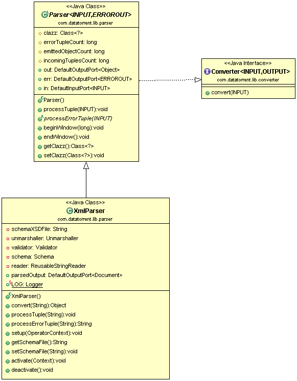

Xml Parser
=============

## Operator Objective
The XmlParser operator parses XML records and constructs POJOs ("Plain Old Java Objects") from them. The operator also emits each record as a DOM Document if the relevant output port is connected. User can also provide a XSD (XML Schema Definition) to validate incoming XML records. Valid records will be emitted as POJOs / DOM Document while invalid ones are emitted on error port with an error message if the error port is connected.

XmlParser is **idempotent**, **fault-tolerant** and **statically/dynamically partitionable**.

## Class Diagram

## Operator Information
1. Operator location: **_malhar-library_**
2. Available since: **_3.2.0_**
3. Operator state: **_Evolving_**
4. Java Package: [com.datatorrent.lib.parser.XmlParser](https://github.com/apache/apex-malhar/blob/master/library/src/main/java/com/datatorrent/lib/parser/XmlParser.java)

## Properties, Attributes and Ports
### <a name="props"></a>Properties of Xml Parser
| **Property** | **Description** | **Type** | **Mandatory** | **Default Value** |
| -------- | ----------- | ---- | ------------------ | ------------- |
| *schemaXSDFile* | [XSD] describing XML data. Incoming records can be validated using the schemaXSDFile. If the data is not as per the requirements specified in schemaXSDFile, they are emitted on the error port. This is an optional property. If the XSD is not provided, incoming tuples are simply converted to POJOs or DOM Documents without any validations| String | No | N/A |

### Platform Attributes that influence operator behavior
| **Attribute** | **Description** | **Type** | **Mandatory** |
| -------- | ----------- | ---- | ------------------ |
| *out.TUPLE_CLASS* | TUPLE_CLASS attribute on output port which tells operator the class of POJO which needs to be emitted. The name of the field members of the class must match with the names in incoming POJO. The operator ignores unknown properties i.e. fields present in POJO but not in TUPLE_CLASS or vice versa.| Class or FQCN| Yes |


### Ports
| **Port** | **Description** | **Type** | **Mandatory** |
| -------- | ----------- | ---- | ------------------ |
| *in*  | Tuples that needs to be parsed are received on this port | byte[] | Yes
| *out* | Valid Tuples that are emitted as pojo. Tuples are converted to POJO only if the port is connected. | Object (POJO) | No |
| *parsedOutput* | Valid Tuples that are emitted as DOM Document. Tuples are converted to DOM Document only if the port is connected.| DOM Document | No |
| *err* | Invalid Tuples are emitted with error message. Invalid tuples are discarded if the port is not connected. | KeyValPair <String, String\> | No |

## Partitioning
XML Parser is both statically and dynamically partitionable.
### Static Partitioning
This can be achieved in 2 ways

1. Specifying the partitioner and number of partitions in the 'populateDAG()' method.
```java
XmlParser xmlParser = dag.addOperator("xmlParser", XmlParser.class);
StatelessPartitioner<XmlParser> partitioner1 = new StatelessPartitioner<XmlParser>(2);
dag.setAttribute(xmlParser, Context.OperatorContext.PARTITIONER, partitioner1 );
```
2. Specifying the partitioner and number of partitions in properties file.
```xml
 <property>
   <name>dt.operator.{OperatorName}.attr.PARTITIONER</name>
   <value>com.datatorrent.common.partitioner.StatelessPartitioner:2</value>
 </property>
```
 where {OperatorName} is the name of the XmlParser operator.
 Above lines will partition XmlParser statically 2 times. Above value can be changed accordingly to change the number of static partitions.


### Dynamic Partitioning

XmlParser can be dynamically partitioned using an out-of-the-box partitioner:

#### Throughput based
Following code can be added to 'populateDAG' method of application to dynamically partition XmlParser:
```java
XmlParser xmlParser = dag.addOperator("xmlParser", XmlParser.class);
StatelessThroughputBasedPartitioner<XmlParser> partitioner = new StatelessThroughputBasedPartitioner<>();
partitioner.setCooldownMillis(conf.getLong("dt.cooldown", 10000));
partitioner.setMaximumEvents(conf.getLong("dt.maxThroughput", 30000));
partitioner.setMinimumEvents(conf.getLong("dt.minThroughput", 10000));
dag.setAttribute(xmlParser, OperatorContext.STATS_LISTENERS, Arrays.asList(new StatsListener[]{partitioner}));
dag.setAttribute(xmlParser, OperatorContext.PARTITIONER, partitioner);
```

Above code will dynamically partition XmlParser when the throughput changes.
If the overall throughput of XmlParser goes beyond 30000 or less than 10000, the platform will repartition XmlParser
to balance throughput of a single partition to be between 10000 and 30000.
'dt.cooldown' of 10000 will be used as the threshold time for which the throughput change is observed.


## Example
Example for Xml Parser can be found at: [https://github.com/DataTorrent/examples/tree/master/tutorials/parser](https://github.com/DataTorrent/examples/tree/master/tutorials/parser)
