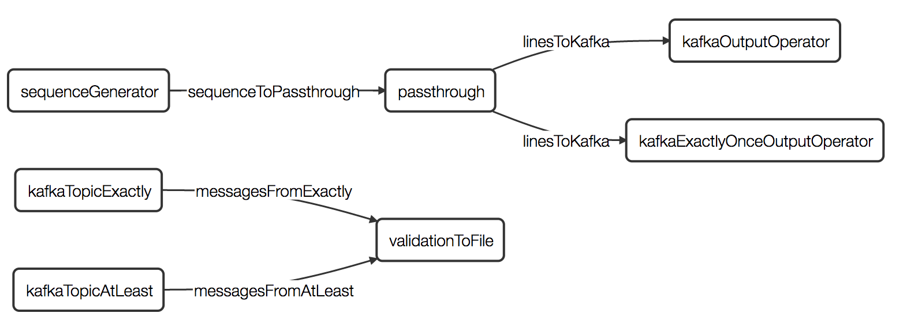

# Kafka exactly-once example (Kafka 0.9 API)

This application verifies exactly-once semantics by writing a defined sequence of input data to two Kafka
output operators -- one that guarantees those semantics and one that does not,
each writing to a different topic. It deliberately causes the intermediate pass-through
operator to fail causing it to be restarted and some tuples to be reprocessed.
Then a KafkaInputOperator reads tuples from both topics to verify that the former topic has no duplicates
but the latter does and writes a single line to a HDFS file with the verification results
of the following form:

    Duplicates: exactly-once: 0, at-least-once: 5

NOTE: KafkaInputOperator guarantees at-least-once semantics; in most scenarios
it also yields exactly-once results, though in rare corner cases duplicate processing
may occur. When this happens validation in this example will output wrong results.

**DAG of this application:**



Plain text representation of DAG:

    sequenceGenerator --> passthrough ==> {kafkaExactlyOnceOutputOperator, kafkaOutputOperator(at-least-once)}

    {kafkaTopicExactly, kafkaTopicAtLeast} --> validationToFile


**Running the Application**

***Run Test***

The application can be run in local mode which will write the validation file
 to target/validation.txt


***Run on Cluster***

To run the application on a cluster a running Kafka service is needed.
 A local Kafka single-node instance can easily be deployed
 (see [kafka.apache.org/quickstart](https://kafka.apache.org/quickstart)).

By default Kafka creates topics automatically when a message
 to a non-existing topic arrives. If disabled manually creation of the two
 topics is needed:
```shell
bin/kafka-topics.sh --create --zookeeper localhost:2181 --replication-factor 1 --partitions 1 --topic exactly-once
bin/kafka-topics.sh --create --zookeeper localhost:2181 --replication-factor 1 --partitions 1 --topic at-least-once
```

Kafka topics should be cleared/deleted after every run in order for
 validation to work correctly

Enable topic deletion in Kafka's server.properties file:
```
delete.topic.enable=true
```

Delete topics:
```shell
bin/kafka-topics --zookeeper localhost:2181 --delete --topic exactly-once
bin/kafka-topics --zookeeper localhost:2181 --delete --topic at-least-once
```

Check if deletion was successful:
```shell
kafka-topics --list --zookeeper localhost:2181
```

****properties:****

By default the Kafka broker is set to 'localhost:9092'. To set a different broker
 address change the value in properties.xml as well as in Application.java
 The directory for the validation file and the number of tuples to be generated
 can also be changed in properties.xml