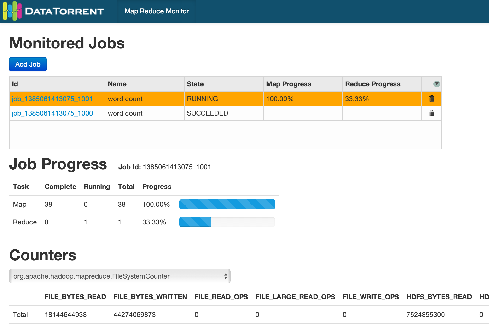

Map Reduce Monitor
===============

Map Reduce Monitor Web Application. Implemented with [Node.js](http://nodejs.org/) and [AngularJS](http://angularjs.org/).



## Configuration
 config.js has application configuration.

 Minimum required configuration:

 - Hadoop ResourceManager

 - Haddop History Server

 - WebSocket URL (DataTorrent Gateway address)

## Prerequisites

  The following should be running:

  - [Map Reduce Monitor Java Application](https://github.com/DataTorrent/Malhar/tree/master/demos/src/main/java/com/datatorrent/demos/mrmonitor)

  - DataTorrent Gateway

## Notes

  It may take 10+ seconds to see data on the first load (Map Reduce Java application starts polling Hadoop REST API
and then publishes it through DataTorrent Gateway WebSocket).

## Running Application in Development Mode
 Install dependencies:

 ``` bash
    $ npm install
 ```

 Install Bower dependencies:

 ``` bash
    $ bower install
 ```

 Start Node.js server:

 ``` bash
    $ node app
 ```

 Application will be available at http://localhost:3000

## Building Application

 Application is built with Grunt (it creates dist folder with optimized JavaScript/CSS).

 ``` bash
    $ npm install -g grunt-cli
    $ grunt
 ```

## Running Application in Production Mode

 In this mode resources are served from dist folder.

 1. Install Node.js.

 2. Install npm dependencies

 ``` bash
    $ npm install
 ```

 3. Install forever tool

 ``` bash
    $ npm install -g forever
 ```

 4. Start Node.js Server (see prod.sh)

 ``` bash
    $ NODE_ENV=production PORT=3000 forever start app.js
 ```

## Tips

 Running Node.js as a daemon with [forever](https://github.com/nodejitsu/forever)

 ``` bash
    $ npm install forever -g
    $ forever start app.js
    $ forever list
    $ forever stop <uid>
 ```

 Running Node.js on different port

 ``` bash
    $ PORT=3001 node app
 ```

## Links

[Node.js](http://nodejs.org/) Software platform built on JavaScript runtime

[Express](https://github.com/visionmedia/express) Node.js web framework

[forever](https://github.com/nodejitsu/forever) Node.js daemon/continuous running/fault tolerance

[AngularJS](http://angularjs.org/) JavaScript framework

[Bower](http://bower.io/) Package manager for the web

[Grunt](http://gruntjs.com/) JavaScript Task Runner

[Yeoman](http://yeoman.io/) Webapp generator

[Google Charts](https://developers.google.com/chart/) Charts by Google

## License

Licensed under the Apache License, Version 2.0 (the "License"); you may not use this file except in compliance with the License. You may obtain a copy of the License at

http://www.apache.org/licenses/LICENSE-2.0

Unless required by applicable law or agreed to in writing, software distributed under the License is distributed on an "AS IS" BASIS, WITHOUT WARRANTIES OR CONDITIONS OF ANY KIND, either express or implied. See the License for the specific language governing permissions and limitations under the License.
